# Configuração do Ambiente no Ubuntu

## 1. Instalação do Apache e do PHP

Nesta etapa, faremos a instalação do Servidor Web Apache, e do interpretador PHP, que deverá deverá funcionar "acoplado" ao servidor web, por um módulo específico.

### 1.1. Verificando se os serviços estão instalados

#### 1.1.1. Apache2

Para verificar se o Apache está instalado e rodando. Para isto, abra o terminal, e digite `sudo service apache2 status`. Informe a senha. Caso não esteja instalado, receberá uma mensagem como a da imagem abaixo:

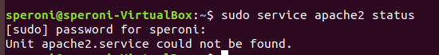

#### 1.1.2. PHP7

Para verificar se o PHP está instalado, no terminal, digite o comando `php -version`. Caso não esteja instalado, receberá uma mensagem como a da imagem abaixo:

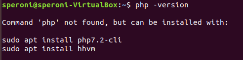

### 1.2. Instalando Apache + PHP

No terminal, digite, primeiro:
```
sudo apt-get update
```
Isto fará com que os pacotes sejam atualizados. Depois, digite: 
```
sudo apt-get install apache2 php libapache2-mod-php
```
Isto fará  com que sejam instalados os pacotes do Servidor Web Apache, o PHP, além do módulo que vincula Apache+PHP.
Com isso, temos a instalação básica de um Servidor Apache com PHP.

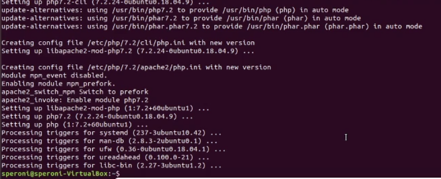

Verifique, novamente, se estão instalados os serviços, repetindo os comandos da seção 1.1.

Apache instalado:
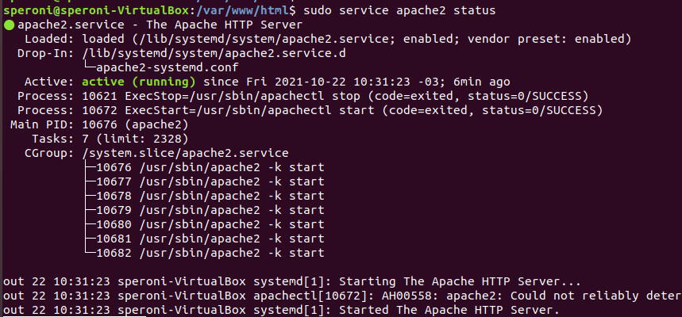

PHP instalado:
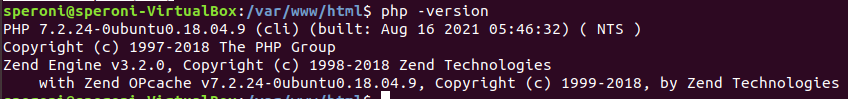

### 1.3 Teste o funcionamento do Apache

Nesta instalação, o servidor apache passará a responder a requisições HTTP no endereço local de seu computador.
Abra o navegador e acesse 
```
http://localhost
```
ou
```
http://127.0.0.1
```

Você deverá ver uma página semelhante a esta da imagem:
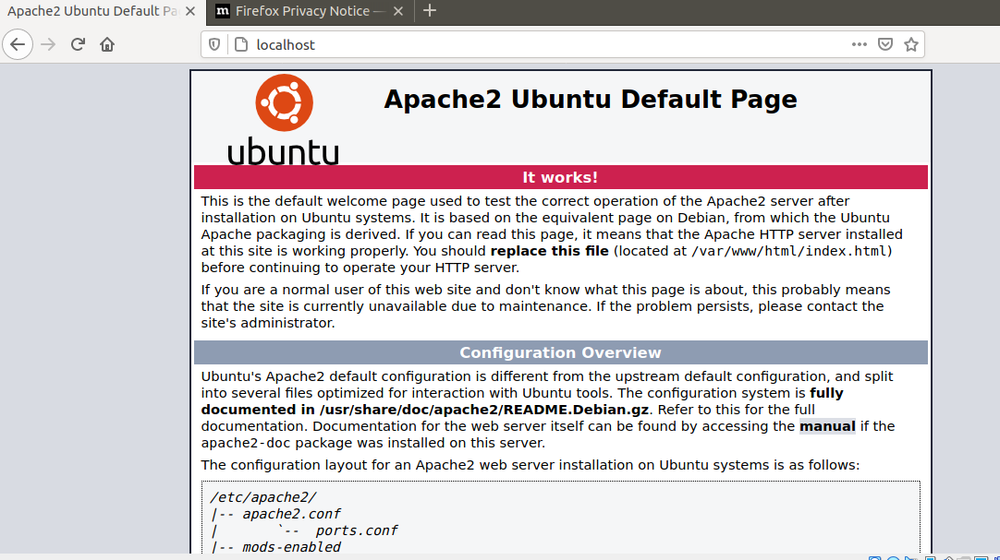

Perceba que esta é uma página HTML sendo servida pelo seu Apache.

Se você parar o serviço com um 
```
sudo service apache2 stop
```
e tentar acessar esta página, a resposta será de que não está disponível.

Portanto, volte a ligar o serviço:
```
sudo service apache2 start
```

#### 1.3.1 Modificando o index.html
No ubuntu, a pasta padrão de documentos do apache é:
```
/var/www/html
```

Pelo terminal, é possível verificar, acessando a pasta, o seu conteúdo, da seguinte forma:
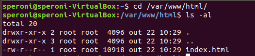

Perceba que a listagem da pasta mostra que o arquivo index.html é de propriedade do **root**, ou seja o super-usuário desta máquina. Isto indica que o seu usuário padrão não terá permissão para escrever neste arquivo. Logo contornaremos este problema, mas vamos testar a modificação do arquivo.

Vamos apagar o `index.html` existente, e criar um novo bem simples:

Na pasta `/var/www/html`, remova o arquivo `index.html`
```
sudo rm index.html
```

E crie um arquivo chamado `teste.html`. Utilizaremos o editor `nano`:
```
sudo nano teste.html
```

Edite um documento conforme segue:

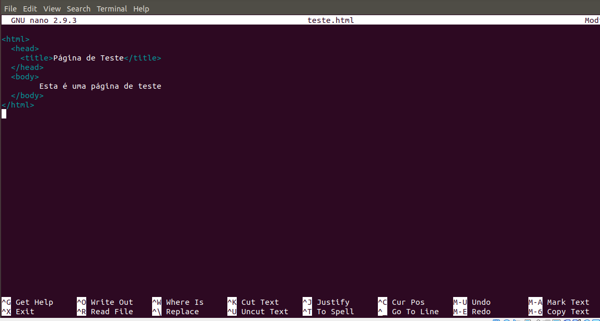

Para salvar, `Ctrl + x`, `Y` e `Enter`.

Agora, acesse o seu navegador em: `http://localhost`, e verifique que será listado o conteúdo da pasta, conforme a imagem abaixo:
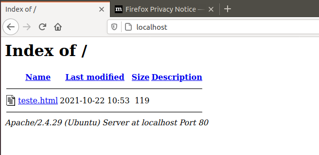

Isto indica que o seu servidor está configurado para listar conteúdo de pastas, **quando não houver um arquivo chamado index.html ou index.php**.

Ao clicar no arquivo `teste.html`, você verá o HTML sendo exibido em seu navegador. É possível que veja algum detalhe de idioma nos caracteres especiais, mas não se preocupe com isso agora.

#### 1.3.2. Testando o PHP no apache

Na mesma pasta, vamos criar um arquivo chamado `teste.php`, também usando o editor `nano`:
```
sudo nano teste.php
```
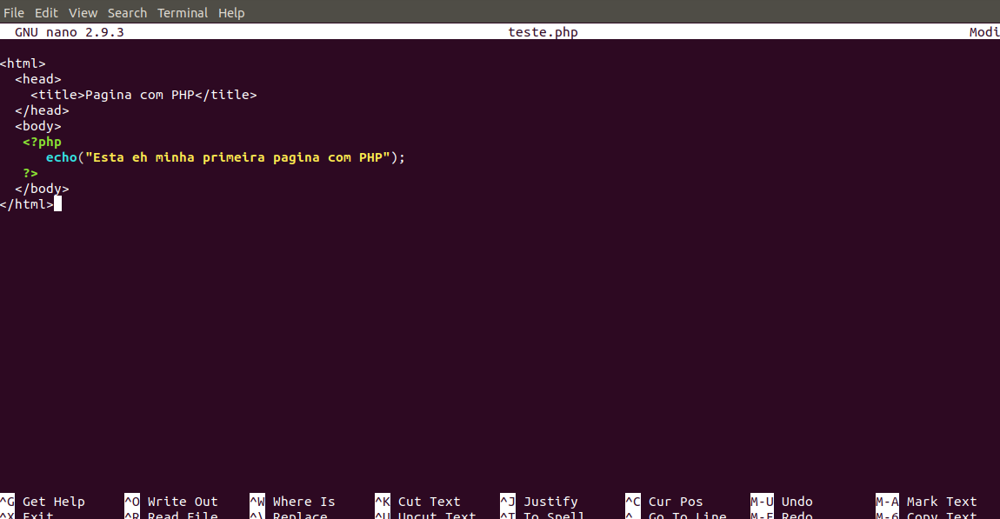

Salve com `Ctrl + x`, `Y` e `Enter`.

Acesse novamente `http://localhost` em seu navegador, e deverá ver a listagem da pasta com os dois arquivos de teste:
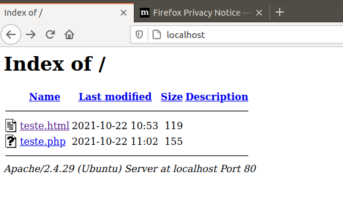

Clique no arquivo `teste.php` e verá o resultado de sua execução, ou seja, um conteúdo HTML. Verifique o código-fonte da página no navegador (`Ctrl + u`), e observe que não aparece o código PHP, mas sim aquilo que ele escreveu.

### 1.4. Criando uma pasta public_html para o seu usuário linux
Como vimos, a pasta padrão do Apache é de propriedade do usuário **root**. Desta forma, para qualquer modificação nos arquivos, necessitamos usar do comando **sudo**. Todavia, não é recomendável que façamos nosso uso rotineiro do sistema como super-usuário.

Poderíamos alteras as permissões de acesso à pasta, mas vamos explorar outra possibilidade que parece mais interessante, considerando a possibilidade de que mais ed um usuário possa fazer uso da mesma máquina, de forma a não "misturar" suas páginas.

O Apache conta com um módulo chamado **userdir**. Trata-se da possibilidade de que cada usuário existente no seu sistema operacional tenha **a sua pasta de páginas** a ser servida pelo Apache.

Para isto, precisaremos habilitar o módulo **userdir**.

No terminal, digite:

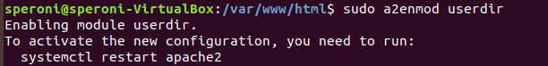

Depois, não esqueça de reiniciar o apache, usando o comando `systemctl`, conforme a orientação, ou o comando `service`, ambos como **sudo**

```
sudo systemctl restart apache2
```
ou 
```
sudo service apache2 restart
```

Feito isso, o módulo **userdir** do seu Apache está habilitado, e você poderá editar suas páginas em uma pasta que ficará no `home` do seu usuário.

#### 1.4.1. Criando a pasta public_html
Vá até o home (Pasta Pessoal) do seu usuário, e crie uma pasta chamada `public_html` (cuide para que tenha exatamente este nome):
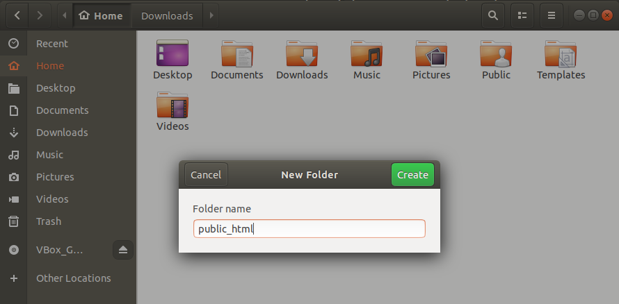

A titulo de informação, esta pasta ficará localizada em `/home/seu_usuario/public_html`.

E será acessível, via navegador, em:
```
http://localhost/~seu_usuario
```

No meu caso, como meu usuario é **speroni**, minha pasta fica em `/home/speroni/public_html`, e posso acessá-la, via navegador, em:
```
http://localhost/~speroni
```
Teremos a listagem da pasta, que ainda está vazia:
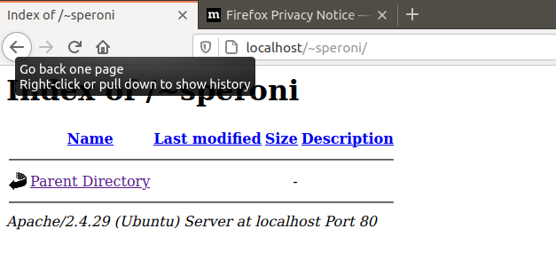

#### 1.4.2. Testando a pasta public_html

Agora, crie um documento chamado teste.html em sua pasta (veja que isso pode ser feito sem **sudo**, pois esta pasta é de sua propriedade).

Acesse a página `http://localhost/~seu_usuario/teste.html`.

Faça o mesmo para `teste.php`, e veja que o documento não será exibido. Em vez disso, seu navegador vai baixar o arquivo `teste.php`.

Isso acontece, porque, por padrão, o módulo **userdir** vem configurado para não executar arquivos com extensão php.

### 1.5. Configurando o userdir para executar PHP

O arquivo de configuraço do módulo userdir do Apache fica em `/etc/apache2/mods-enabled/php7.2.conf`. *Veja que a versão do PHP pode mudar, a depender da que estiver instalada em sua máquina.

Vamos editar este arquivo, com **sudo**, usando o editor `nano`. No terminal:
```
sudo nano /etc/apache2/mods-enabled/php7.2.conf
```
E comente com # as últimas linhas do arquivo, de `<IfModule mod_userdir.c>` até `<IfModule>`:
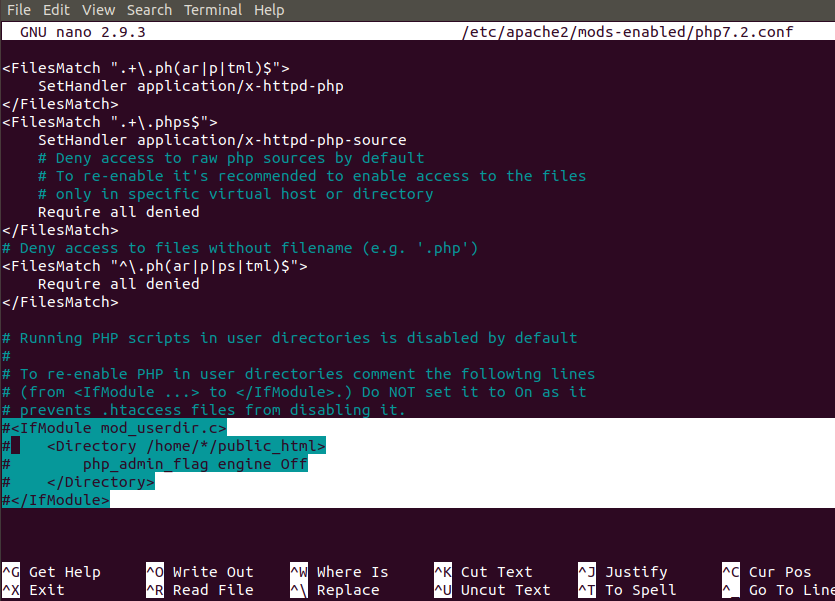

Salve com `Ctrl + x`, `Y` e `Enter`.

Agora reinicie o serviço do Apache:
```
sudo service apache2 restart
```

Teste no navegador o acesso ao seu arquivo `teste.php`. Ele deverá ser executado normalmente, tal qual aconteceu com o primeiro teste na pasta padrão do Apache.

### 1.5. Iniciando o seu projeto

Para iniciar o projeto, crie uma pasta chamada **projeto** dentro de sua pasta **public_html**.

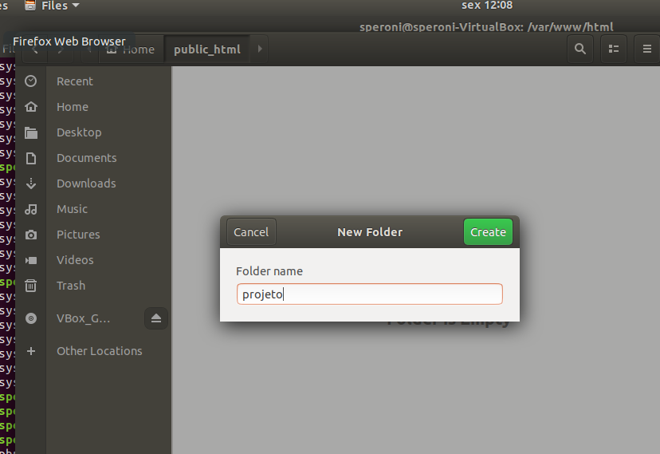

Dentro desta pasta, crie os arquivos de seu projeto.

## 2. Editor de códigos

Escolha um editor de sua preferência, instale e abra a pasta de seu projeto, e passe à [Parte 1](parte1.md) do Tutorial.

