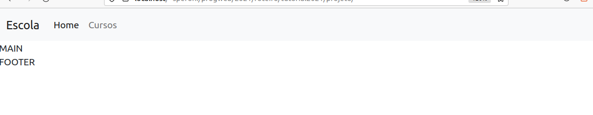
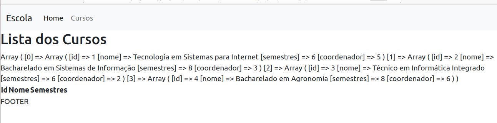

# Parte1

Na primeira parte deste tutorial, criaremos um exemplo de site com conteúdo dinâmico, usando PHP e CSS.

Como ainda não tratamos de Bancos de Dados, inicialmente nossos dados serão armazenados em Arrays.

A opção inicial pelo uso de Arrays justifica-se pela necessidade de exercitar tais conceitos.

## 1. A Página Principal
A página principal do projeto traz uma lista dos Cursos ofertados em uma instituição de ensino, conforme a imagem abaixo:


## 2. Criação do HTML Básico
Primeiramente, criaremos um documento chamado **index.php**, que deverá conter um elemento `<header>`, um elemento `<main>` e um elemento `<footer>`.
Vamos utilizar o bootstrap. Então, também incluiremos os elementos correspondente à inclusão do CSS e do JS do [Bootstrap](https://getbootstrap.com/).
 A seguir, o conteúdo inicial do `index.php`:
```html
<!DOCTYPE html>
<html lang="en">
<head>
    <meta charset="UTF-8">
    <meta http-equiv="X-UA-Compatible" content="IE=edge">
    <meta name="viewport" content="width=device-width, initial-scale=1.0">
    <title>Document</title>
    <!-- CSS Bootstrap -->
    <link href="https://cdn.jsdelivr.net/npm/bootstrap@5.1.1/dist/css/bootstrap.min.css" rel="stylesheet" integrity="sha384-F3w7mX95PdgyTmZZMECAngseQB83DfGTowi0iMjiWaeVhAn4FJkqJByhZMI3AhiU" crossorigin="anonymous">
</head>
<body>
    <header>HEADER</header>
    <main>MAIN</main>
    <footer>FOOTER</footer>
    <!-- JavaScript Bootstrap -->
    <script src="https://cdn.jsdelivr.net/npm/bootstrap@5.1.1/dist/js/bootstrap.bundle.min.js" integrity="sha384-/bQdsTh/da6pkI1MST/rWKFNjaCP5gBSY4sEBT38Q/9RBh9AH40zEOg7Hlq2THRZ" crossorigin="anonymous"></script>
</body>
</html>
```

## 3. Separando o Cabeçalho e o Rodapé da página
Para exemplificar o uso da função include() do PHP, colocaremos a parte inicial da página (até o fim do elemento `<header>`) em um arquivo chamado **cabecalho.html**.

Da mesma forma, colocaremos o conteúdo da parte final da página (a partir do início do elemento `<footer>`) em um arquivo chamado **rodape.html**.

Estas partes que já foram para os outros arquivos serão excluídas do **index.php**. Em seu lugar, utilizaremos a função include(), que fará com que o conteúdo daqueles arquivos seja **incluído** ali.

O conteúdo do arquivo `cabecalho.html`:
```html
<!DOCTYPE html>
<html lang="en">
<head>
    <meta charset="UTF-8">
    <meta http-equiv="X-UA-Compatible" content="IE=edge">
    <meta name="viewport" content="width=device-width, initial-scale=1.0">
    <title>Document</title>
    <!-- CSS Bootstrap -->
    <link href="https://cdn.jsdelivr.net/npm/bootstrap@5.1.1/dist/css/bootstrap.min.css" rel="stylesheet" integrity="sha384-F3w7mX95PdgyTmZZMECAngseQB83DfGTowi0iMjiWaeVhAn4FJkqJByhZMI3AhiU" crossorigin="anonymous">
</head>
<body>
    <header>HEADER</header>
```

O conteúdo do arquivo `index.php`:
```php
<?php
  //inclui o conteudo do arquivo
  include('cabecalho.html');
?>

<main>MAIN</main>

<?php
  //inclui o conteudo do arquivo
  include('rodape.html');
?>
```

O conteúdo do arquivo `rodape.html`:
```html
<footer>FOOTER</footer>
<!-- JavaScript Bootstrap -->
<script src="https://cdn.jsdelivr.net/npm/bootstrap@5.1.1/dist/js/bootstrap.bundle.min.js" integrity="sha384-/bQdsTh/da6pkI1MST/rWKFNjaCP5gBSY4sEBT38Q/9RBh9AH40zEOg7Hlq2THRZ" crossorigin="anonymous"></script>
</body>
</html>
```

## 4. Adicionando um Navbar do Bootstrap
Para fazer a parte superior da página se comportar como um menu, e já contando com a responsividade, utilizaremos um [navbar](https://getbootstrap.com/docs/5.1/components/navbar/).

No arquivo `cabecalho.html`, dentro da tag `<header>`, acrescente o código que segue (este é um dos exemplos de Navbar do Bootstrap, com algumas modificações nos conteúdos).
O arquivo `cabecalho.html`, agora:
```html
<!DOCTYPE html>
<html lang="en">
<head>
    <meta charset="UTF-8">
    <meta http-equiv="X-UA-Compatible" content="IE=edge">
    <meta name="viewport" content="width=device-width, initial-scale=1.0">
    <title>Document</title>
    <!-- CSS Bootstrap -->
    <link href="https://cdn.jsdelivr.net/npm/bootstrap@5.1.1/dist/css/bootstrap.min.css" rel="stylesheet" integrity="sha384-F3w7mX95PdgyTmZZMECAngseQB83DfGTowi0iMjiWaeVhAn4FJkqJByhZMI3AhiU" crossorigin="anonymous">
</head>
<body>
    <header>
        <nav class="navbar navbar-expand-lg navbar-light bg-light">
            <div class="container-fluid">
              <a class="navbar-brand" href="#">Escola</a>
              <button class="navbar-toggler" type="button" data-bs-toggle="collapse" data-bs-target="#navbarSupportedContent" aria-controls="navbarSupportedContent" aria-expanded="false" aria-label="Toggle navigation">
                <span class="navbar-toggler-icon"></span>
              </button>
              <div class="collapse navbar-collapse" id="navbarSupportedContent">
                <ul class="navbar-nav me-auto mb-2 mb-lg-0">
                  <li class="nav-item">
                    <a class="nav-link active" aria-current="page" href="#">Home</a>
                  </li>
                  <li class="nav-item">
                    <a class="nav-link" href="#">Cursos</a>
                  </li>
                </ul>
              </div>
            </div>
          </nav>        
    </header>
```

A inclusão do **navbar** faz com que a página index fique com a aparência semelhante à da figura abaixo:


## 5. Coloque algum conteúdo no `<main>`

Agora, para que sua página inicial tenha algum conteúdo na área principal, no arquivo `index.php`, no elemento `<main>`, acrescente um conteúdo como:
```html
<main>
    <p>Seja bem-vindo à página da nossa escola!</p>
    <p>Aqui você encontra informações sobre nossos cursos</p>
</main>
```
## 6. Os Dados - Arquivo dados.php

Como já foi dito anteriormente, a primeira etapa deste projeto não conta com o suporte de Banco de Dados. Assim, vamos construir páginas de conteúdo dinâmico, cujos dados estão armazenados em Arrays PHP. Como disse, uma adaptação para exercitar Arrays (tem um motivo nobre no formato escolhido, acreditem :-) ).

Na pasta `projeto`, crie um arquivo chamado `dados.php`. Este arquivo vai conter alguns Arrays multidimensionais, que armazenam nossos dados.
O arquivo `dados.php`:
```php
<?php
$professores = array(
    array("id" => 1, "nome" => "André Moraes"),
    array("id" => 2, "nome" => "Ângelo Frozza"),
    array("id" => 3, "nome" => "Daniel Anderle"),
    array("id" => 4, "nome" => "Daniel Varela"),
    array("id" => 5, "nome" => "Rafael Speroni"),
    array("id" => 6, "nome" => "Lidiane Visintin")
);

$cursos = array(
    array(
        "id" => 1,
        "nome" => "Tecnologia em Sistemas para Internet",
        "semestres" => 6,
        "coordenador" => 5
    ),
    array(
        "id" => 2,
        "nome" => "Bacharelado em Sistemas de Informação",
        "semestres" => 8,
        "coordenador" => 3
    ),
    array(
        "id" => 3,
        "nome" => "Técnico em Informática Integrado",
        "semestres" => 6,
        "coordenador" => 2
    ),
    array(
        "id" => 4,
        "nome" => "Bacharelado em Agronomia",
        "semestres" => 8,
        "coordenador" => 6
    )
);

$disciplinas = array(
    array(
        "id" => 1,
        "codigo" => "STB0301",
        "nome" => "Matemática Elementar",
        "carga" => 60,
        "ementa" => "Conjuntos Numéricos:  Conjunto dos números Naturais; Conjunto dos números Inteiros; Conjunto dos números Racionais: Frações e operações com frações.",
        "semestre" => 1,
        "id_curso" => 1
    ),
    array(
        "id" => 2,
        "codigo" => "STB0302",
        "nome" => "Inglês Instrumental",
        "carga" => 60,
        "ementa" => "Conscientização do processo de leitura. Estratégias de leitura. Gramática aplicada da língua inglesa. Reconhecimento de gêneros textuais e aquisição de vocabulário. Análise textual de um gênero. Leitura intensiva de diversos gêneros textuais da área de Informática. Redação acadêmica.",
        "semestre" => 1,
        "id_curso" => 1
    ),
    array(
        "id" => 3,
        "codigo" => "STB0303",
        "nome" => "Introdução à Computação",
        "carga" => 30,
        "ementa" => "Evolução da computação (tecnologias e usos). Modelos funcionais dos computadores. Sistemas de códigos e codecs. Sistemas operacionais. Linguagens de programação. Sistemas de rede e Internet. Open Source/Free Software. O estado da arte. TI x Sustentabilidade.",
        "semestre" => 1,
        "id_curso" => 1
    ),
    array(
        "id" => 4,
        "codigo" => "STB0304",
        "nome" => "Introdução à Programação Web",
        "carga" => 60,
        "ementa" => "Infraestrutura do Ambiente Web; Páginas Estáticas e Páginas Dinâmicas; Introdução a Linguagem de Marcação HTML e suas evoluções; Folhas de Estilos (CSS); Introdução a Programação Client-Side (JavaScript); Princípios para Web Design Responsivo.",
        "semestre" => 1,
        "id_curso" => 1
    ),
    array(
        "id" => 5,
        "codigo" => "STB0305",
        "nome" => "Algoritmos e Técnicas de Programação",
        "carga" => 90,
        "ementa" => "Introdução à lógica de programação. Conceitos básicos sobre  algoritmos.  Algoritmos  Estruturados: conceitos, estruturas de controle (seqüência, seleção e repetição)entrada  e  saída,  atribuição; Operadores Básicos (Aritméticos, Relacionais e Lógicos);  Resolução  de problemas usando algoritmos; Verificação e correção de algoritmos através de testes de mesa; Implementações de algoritmos  em  uma  linguagem  de  programação.Procedimentos  e  Funções.",
        "semestre" => 1,
        "id_curso" => 1            
    ),

    array(
        "id" => 6,
        "codigo" => "STB0306",
        "nome" => "Estrutura de Dados",
        "carga" => 60,
        "ementa" => "Conjuntos Numéricos:  Conjunto dos números Naturais; Conjunto dos números Inteiros; Conjunto dos números Racionais: Frações e operações com frações.",
        "semestre" => 2,
        "id_curso" => 1
    ),
    array(
        "id" => 7,
        "codigo" => "STB0307",
        "nome" => "Banco de Dados I",
        "carga" => 60,
        "ementa" => "Conscientização do processo de leitura. Estratégias de leitura. Gramática aplicada da língua inglesa. Reconhecimento de gêneros textuais e aquisição de vocabulário. Análise textual de um gênero. Leitura intensiva de diversos gêneros textuais da área de Informática. Redação acadêmica.",
        "semestre" => 2,
        "id_curso" => 1
    ),
    array(
        "id" => 8,
        "codigo" => "STB0308",
        "nome" => "Sistemas Operacionais",
        "carga" => 60,
        "ementa" => "Evolução da computação (tecnologias e usos). Modelos funcionais dos computadores. Sistemas de códigos e codecs. Sistemas operacionais. Linguagens de programação. Sistemas de rede e Internet. Open Source/Free Software. O estado da arte. TI x Sustentabilidade.",
        "semestre" => 2,
        "id_curso" => 1
    ),
    array(
        "id" => 9,
        "codigo" => "STB0309",
        "nome" => "Engenharia de Software I",
        "carga" => 60,
        "ementa" => "Infraestrutura do Ambiente Web; Páginas Estáticas e Páginas Dinâmicas; Introdução a Linguagem de Marcação HTML e suas evoluções; Folhas de Estilos (CSS); Introdução a Programação Client-Side (JavaScript); Princípios para Web Design Responsivo.",
        "semestre" => 2,
        "id_curso" => 1
    ),
    array(
        "id" => 10,
        "codigo" => "STB0305",
        "nome" => "Programação Web",
        "carga" => 60,
        "ementa" => "Introdução à lógica de programação. Conceitos básicos sobre  algoritmos.  Algoritmos  Estruturados: conceitos, estruturas de controle (seqüência, seleção e repetição)entrada  e  saída,  atribuição; Operadores Básicos (Aritméticos, Relacionais e Lógicos);  Resolução  de problemas usando algoritmos; Verificação e correção de algoritmos através de testes de mesa; Implementações de algoritmos  em  uma  linguagem  de  programação.Procedimentos  e  Funções.",
        "semestre" => 2,
        "id_curso" => 1            
    ),
    array(
        "id" => 11,
        "codigo" => "SIB0312",
        "nome" => "Desenvolvimento Web I",
        "carga" => "60",
        "ementa" => "Introdução à lógica de programação. Conceitos básicos sobre  algoritmos.  Algoritmos  Estruturados: conceitos, estruturas de controle (seqüência, seleção e repetição)entrada  e  saída,  atribuição; Operadores Básicos (Aritméticos, Relacionais e Lógicos);  Resolução  de problemas usando algoritmos; Verificação e correção de algoritmos através de testes de mesa; Implementações de algoritmos  em  uma  linguagem  de  programação.Procedimentos  e  Funções.",
        "semestre" => 5,
        "id_curso" => 2            
    ),
    array(
        "id" => 11,
        "codigo" => "SIB0313",
        "nome" => "Desenvolvimento Web II",
        "carga" => "60",
        "ementa" => "Introdução à lógica de programação. Conceitos básicos sobre  algoritmos.  Algoritmos  Estruturados: conceitos, estruturas de controle (seqüência, seleção e repetição)entrada  e  saída,  atribuição; Operadores Básicos (Aritméticos, Relacionais e Lógicos);  Resolução  de problemas usando algoritmos; Verificação e correção de algoritmos através de testes de mesa; Implementações de algoritmos  em  uma  linguagem  de  programação.Procedimentos  e  Funções.",
        "semestre" => 6,
        "id_curso" => 2            

    )    
);
```
Os dados estão dispostos em 3 Arrays: `$professores`, `$cursos`, `$disciplinas`.
Observe que os Arrays são multidimensionais. No caso específico, contêm duas dimensões. São matrizes, portanto.
O Array `$professores` contem 06 posições (linhas da matriz), e duas posições dentro de cada linha.
As 06 posições contidas em `$professores` têm um índice numérico padrão, que começa em 0 e vai até 5 (comportamento padrão de Arrays Indexados PHP).
Cada posição desse Array guarda um outro Array com índices textuais (característica de Arrays Associativos PHP)como `array("id" => 5, "nome" => "Rafael Speroni")`. Neste caso os índices são `id` e `nome`.

Desta forma, como o professor Rafael Speroni encontra-se na posição equivalente à quinta "linha" do Array `professores`, corresponde ao índice `$professores[4]`.
Como `$professores[4]` contem um Array com duas posições textuais, o nome do prof. Rafael pode ser encontrado em `$professores[4]['nome']`.

A mesma lógica vale para os Arrays `$curso` e `$disciplinas`.

Portanto, no Array `$cursos()`, o nome do curso TSI encontra-se na posição `$cursos[0]['nome']`. 

## 6. Uma função que retorne o Array `$cursos`

Agora, queremos criar uma função chamada `getCursos()`, que deverá **retornar** o Array contendo todos os dados de todos os cursos.
Novamente, esta função parece muito simples (de fato é), mas tem sua justificativa de existir, que será explicada depois.
No arquivo `dados.php`, crie a função `getCursos()`, que apenas retornará o Array completo.
Acrescente a função ao final do arquivo `dados.php`:
```php
//variavel $cursos foi definida fora da função (Escopo Global)
function getCursos(){
    global $cursos; //a funcao passa a "conhecer" a variavel definida fora
    return $cursos;
}
```

## 7. A Página `cursos.php`

Agora que já temos um script PHP que contém conjuntos de dados, e uma função que retorna todos os dados de todos os cursos, vamos criar uma página capaz de exibi-los.

Primeiro, criaremos o link no menu. No arquivo `cabecalho.html`, altere o local para onde aponta o link **Cursos**.
```html
                  <li class="nav-item">
                    <a class="nav-link" href="cursos.php">Cursos</a>
                  </li>
```

Na pasta `projeto`, crie um arquivo chamado `cursos.php`, que deverá ter o mesmo cabeçalho e o mesmo rodapé utilizados na página inicial. 
Na verdade, sua estrutura toda é a mesma. O que muda é o conteúdo do elemento `<main>`. Portanto, crie o seu `cursos.php` com a seguinte aparência:
```php
<?php
  include('cabecalho.html');
?>
  <main>Lista dos Cursos</main>
<?php
  include('rodape.html');
?>
``` 
Observe que trata-se de uma página quase igual à `index.php`.

Agora, queremos apresentar os dados em uma tabela HTML. Então, vamos criar a estrutura básica de uma tabela com 3 colunas.
O arquivo `cursos.php` ficará assim:
```php
<?php
  include('cabecalho.html');
?>
  <main>
      <h2>Lista dos Cursos</h2>
      <table>
          <thead>
              <th>Id</th>
              <th>Nome</th>
              <th>Semestres</th>
          </thead>
          <tbody>
              <!-- Aqui vão as linhas com os dados -->
          </tbody>
      </table>
  </main>
<?php
  include('rodape.html');
?>
```
### Apresentando os dados de cursos

Assim como fizemos com os HTMLs de cabeçalho e rodapé, queremos usar o conteúdo do arquivo `dados.php`.
Portanto, faremos um novo `include()` no arquivo `cursos.php`.
```php
<?php
  include('cabecalho.html');
  include('dados.php');
  ...
?>
```
A seguir, no local onde deixamos o espaço reservado para a exibição dos dados, vamos, inicialmente visualizar o Array inteiro.
O comando `echo()` não é capaz de exibir o conteúdo de um Array. Portanto, apenas para fins de teste, utilizaremos a função `print_r()` para exibir o conteúdo do Array, ainda que de forma rudimentar.
No arquivo `cursos.php`, no corpo da tabela:
```php
...
          <tbody>
              <!-- Aqui vão as linhas com os dados -->
              <?php
                $cursos = getCursos();
                print_r($cursos);
              ?>
          </tbody>
...          
``` 
Acessando em seu navegador a página `cursos.php`, verá algo como:

