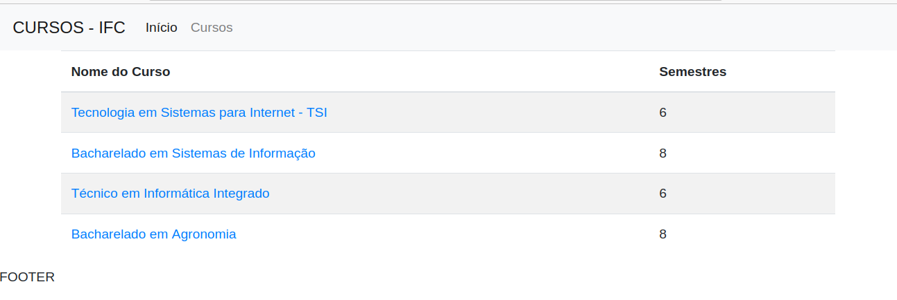

# Parte1

Na primeira parte deste tutorial, criaremos um exemplo de site com conteúdo dinâmico, usando PHP e CSS.

Como ainda não tratamos de Bancos de Dados, inicialmente nossos dados serão armazenados em Arrays.

A opção inicial pelo uso de Arrays justifica-se pela necessidade de exercitar tais conceitos.

## 1. A Página Principal
A página principal do projeto traz uma lista dos Cursos ofertados em uma instituição de ensino, conforme a imagem abaixo:


## 2. Criação do HTML Básico
Primeiramente, criaremos um documento chamado **index.php**, que deverá conter um elemento `<header>`, um elemento `<main>` e um elemento `<footer>`.
Vamos utilizar o bootstrap. Então, também incluiremos os elementos correspondente à inclusão do CSS e do JS do [Bootstrap](https://getbootstrap.com/).
 A seguir, o conteúdo inicial do `index.php`:
```html
<!DOCTYPE html>
<html lang="en">
<head>
    <meta charset="UTF-8">
    <meta http-equiv="X-UA-Compatible" content="IE=edge">
    <meta name="viewport" content="width=device-width, initial-scale=1.0">
    <title>Document</title>
    <!-- CSS Bootstrap -->
    <link href="https://cdn.jsdelivr.net/npm/bootstrap@5.1.1/dist/css/bootstrap.min.css" rel="stylesheet" integrity="sha384-F3w7mX95PdgyTmZZMECAngseQB83DfGTowi0iMjiWaeVhAn4FJkqJByhZMI3AhiU" crossorigin="anonymous">
</head>
<body>
    <header>HEADER</header>
    <main>MAIN</main>
    <footer>FOOTER</footer>
    <!-- JavaScript Bootstrap -->
    <script src="https://cdn.jsdelivr.net/npm/bootstrap@5.1.1/dist/js/bootstrap.bundle.min.js" integrity="sha384-/bQdsTh/da6pkI1MST/rWKFNjaCP5gBSY4sEBT38Q/9RBh9AH40zEOg7Hlq2THRZ" crossorigin="anonymous"></script>
</body>
</html>
```

## 3. Separando o Cabeçalho e o Rodapé da página
Para exemplificar o uso da função include() do PHP, colocaremos a parte inicial da página (até o fim do elemento `<header>`) em um arquivo chamado **cabecalho.html**.

Da mesma forma, colocaremos o conteúdo da parte final da página (a partir do início do elemento `<footer>`) em um arquivo chamado **rodape.html**.

Estas partes que já foram para os outros arquivos serão excluídas do **index.php**. Em seu lugar, utilizaremos a função include(), que fará com que o conteúdo daqueles arquivos seja **incluído** ali.

O conteúdo do arquivo `cabecalho.html`:
```html
<!DOCTYPE html>
<html lang="en">
<head>
    <meta charset="UTF-8">
    <meta http-equiv="X-UA-Compatible" content="IE=edge">
    <meta name="viewport" content="width=device-width, initial-scale=1.0">
    <title>Document</title>
    <!-- CSS Bootstrap -->
    <link href="https://cdn.jsdelivr.net/npm/bootstrap@5.1.1/dist/css/bootstrap.min.css" rel="stylesheet" integrity="sha384-F3w7mX95PdgyTmZZMECAngseQB83DfGTowi0iMjiWaeVhAn4FJkqJByhZMI3AhiU" crossorigin="anonymous">
</head>
<body>
    <header>HEADER</header>
```

O conteúdo do arquivo `index.php`:
```php
<?php
  //inclui o conteudo do arquivo
  include('cabecalho.html');
?>

<main>MAIN</main>

<?php
  //inclui o conteudo do arquivo
  include('rodape.html');
?>
```

O conteúdo do arquivo `rodape.html`:
```html
<footer>FOOTER</footer>
<!-- JavaScript Bootstrap -->
<script src="https://cdn.jsdelivr.net/npm/bootstrap@5.1.1/dist/js/bootstrap.bundle.min.js" integrity="sha384-/bQdsTh/da6pkI1MST/rWKFNjaCP5gBSY4sEBT38Q/9RBh9AH40zEOg7Hlq2THRZ" crossorigin="anonymous"></script>
</body>
</html>
```

## 4. Adicionando um Navbar do Bootstrap
Para fazer a parte superior da página se comportar como um menu, e já contando com a responsividade, utilizaremos um [navbar](https://getbootstrap.com/docs/5.1/components/navbar/).

No arquivo `cabecalho.html`, dentro da tag `<header>`, acrescente o código que segue (este é um dos exemplos de Navbar do Bootstrap, com algumas modificações nos conteúdos)
```html

```