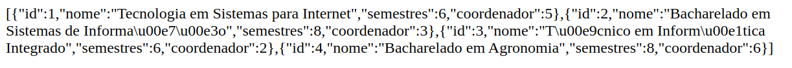
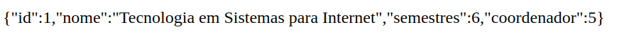
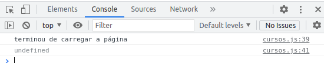
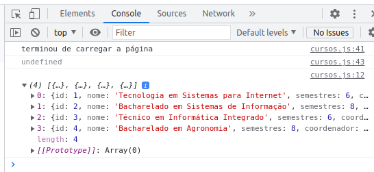
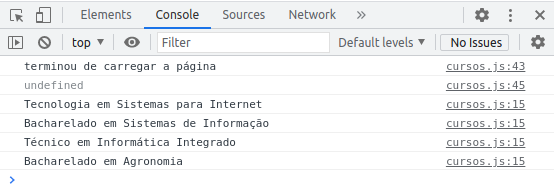
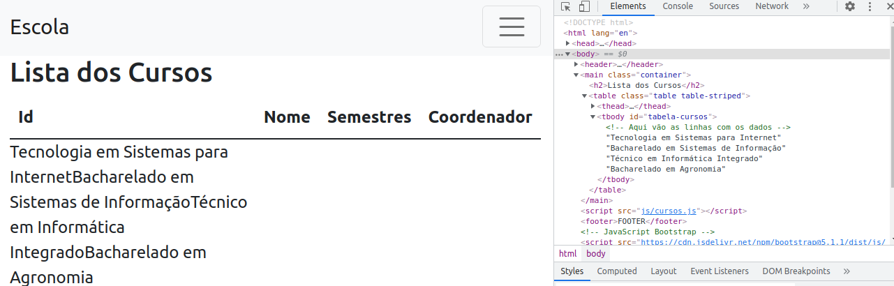
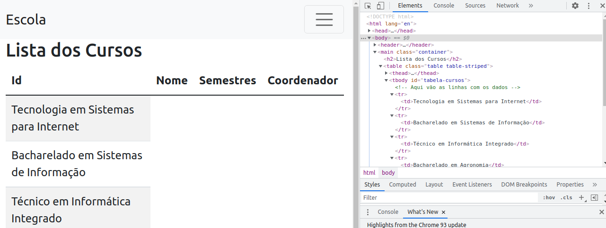

# Parte 2

Na Parte 1, fizemos uma primeira versão de uma página com conteúdo dinâmico, cujos dados estavam armazenados em Arrays.
As páginas dinâmicas foram geradas pelo PHP, que construiu o HTML e fez o envio dos conetúdos "prontos" para o cliente.

Agora, faremos alterações, no sentido de dotar nossas páginas com códigos JS que farão requisições e receberão respostas, e que farão a manipulação das mesmas, alterando as páginas.


## 1. Criando um "endpoint" PHP para cursos

Antes, fizemos com que a página cursos fosse construída completamente pelo PHP, que entregou o HTML pronto para o navegador.
Agora, vamos criar um script que será responsável por entregar uma lista de Cursos ou um único curso, em formato JSON.

JSON (JavaScript Object Notation) é um formato semi-estruturado de dados que possibilita a interoperabilidade entre sistemas, de tal forma que os dados sejam enviados contendo, também, alguma estrutura.

### 1.1 A função **json_encode()** do PHP

O PHP conta com uma fução chamada `json_encode()`, que é capaz de "serializar" dados, ou seja, transformar dados em estruturas próprias (Arrays ou Objetos) em texto, sem perder a sua estrutura.

Verifique o material da aula sobre JSON no SIGAA.

### 1.2 Criando o "endpoint" PHP que retornará dados de curso em JSON

Na pasta do seu projeto, crie uma pasta chamada **api**, e, dentro desta, um arquivo chamado `cursos.php`.
O script `cursos.php` será responsável por obter os dados de UM ou de TODOS OS CURSOS, e retornar os dados em formato JSON. Veja que, agora, não queremos retornar um HTML.

Conteúdo do arquivo `api/dadoscursos.php`
```php
<?php
//este script busca os dados de um curso ou de todos
//inclui o arquivo que contém os dados e as funções getCursos() e getCursoById()
  include_once('../dados.php');

//caso o Query String traga um parâmetro id
if(isset($_GET['id'])){
    //busca o Array com os dados de um curso específico, e codifica em JSON e escreve
    echo json_encode(getCursoPorId($_GET['id']));
}else{ // caso não traga id
    //busca o Array com os dados de todos os cursos, e codifica em JSON e escreve
    echo json_encode(getCursos());
  }
?>
```

Para testar a utilização do script, vá ao navegador, e teste o acesso direto a ele em **http://localhost/.../api/dadoscursos.php** (observe o caminho correto do seu projeto). Deverá ver algo como a imagem abaixo.



Agora, para testar o retorno dos dados de um curso específico, vamos passar um parâmetro id no **Query String**. Para isso, acesse **http://localhost/.../api/dadoscursos.php?id=1** (observe o caminho correto do seu projeto). Deverá ver algo como a imagem abaixo (dados de apenas um curso).



Com isso, conseguimos criar um script PHP, que retorna dados de cursos em formato JSON. E este script funciona tanto para retornar todos os cursos, como um curso específico. Este é um comportamento sobre o qual falaremos mais depois, mas que vai na direção daquilo que se deseja quando se desenvolve na forma de Web Services.

## 2. Alterando a página cursos.php, para que faça requisição Assíncrona

Vamos alterar a PÁGINA `cursos.php`. Trata-se daquela página que exibe os dados dos cursos. Originalmente, criamos esta página de forma que ela tem o seu HTML construído pelo PHP. Agora, desejamos fazer com que o JavaScript faça uma requisição assíncrona (AJAX), e receba os dados em JSON.

Remova o trecho PHP que fazia a montagem das linhas da tabela (dentro de tbody).

Seu arquivo `cursos.php` ficará assim:
```php
<?php
  include('cabecalho.html');
  include('dados.php');
?>
  <main class="container">
      <h2>Lista dos Cursos</h2>
      <table class="table table-striped">
          <thead>
              <th>Id</th>
              <th>Nome</th>
              <th>Semestres</th>
              <th>Coordenador</th>
          </thead>
          <tbody id="tabela-cursos">
              <!-- Aqui vão as linhas com os dados -->

          </tbody>
      </table>
  </main>
<?php
  include('rodape.html');
?>
```

Na pasta do seu projeto, crie uma pasta chamada **js**. Dentro dela, crie um arquivo chamado `cursos.js`. Este será o arquivo JavaScript onde serão desenvolvidas as funções para busca dos dados e manipulação dos resultados.

No arquivo `js/cursos.js`, começaremos criando uma função para o evento **onload** da página. Em outras palavras, estamos indicando o que deve ser executado quando a página terminar de ser carregada.

```javascript
window.onload = function(){
    console.log('terminou de carregar a página');
}
```

Para que a página utilize esse javascript, adicione em `cursos.php`, depois do `</main>`, a tag script, para que possa utilizar o cursos.js.

```php
...
    </table>
  </main>

<script src="js/cursos.js"></script>  
<?php
```

Isto faz com que, ao ser carregada, a página `cursos.php` chame o `js/cursos.js`. Ao completar o carregamento da página, o evento **onload** é executado, e a frase é escrita no console.

Para visualizar o console, acesse a página **cursos.php** do seu projeto no navegador, e tecle F12. Na aba console, você deverá ver uma mensagem assim:



Isto indica que o seu JavaScript está funcionando, ou seja, que ao terminar de carregar a página, o evento onload foi executado, e, consequentemente, uma mensagem foi escrita no console.

Uma vez que o JS está executando, vamos às requisições.

## 2.1. Criando uma função JS para requisição dos dados de Cursos

Já temos:
- Script php `api/dadoscursos.php` que retorna os dados dos cursos em JSON;
- Página `cursos.php`, com a tabela em branco;
- Arquivo `js/cursos.js` executando a função para onload.

Vamos criar uma função para fazer a requisição Assíncrona (AJAX) dos dados.

Em termos simples, queremos que a função JS faça:
1 - Requisição GET para `api/dadoscursos.php`;
2 - Como resposta a essa requisição, receberá dados de todos os cursos, em formato JSON;
3 - Os dados serão percorridos (como um Array);
4 - Para cada curso contido nos dados, criaremos uma linha na tabela HTML da página;

Para fazer a requisição, utilizaremos a fetch API.

No arquivo `js/cursos.js`:
```javascript
function buscaCursos(){
    //funcao que busca os dados em api/cursos.php e monta o HTML na página
    
    fetch('api/dadoscursos.php') //url sendo requisitada
        .then((resposta) => { //pega a resposta no formato json
            return resposta.json();
        })
        .then((dados) => {    //aquela resposta contem dados
            console.log(dados);  //exibe os dados no console
        }); 
    })
    .catch(err => console.error(err)); //caso dê erro, mostra no console
}
//as variaveis resposta e dados poderiam ter outros nomes, a seu gosto, mas assim fica bem explicativo
```

O que temos aqui, é uma requisição assíncrona, utilizando a fetch API. De maneira simplificada, ela é assíncrona, pois ela retorna uma PROMESSA **promise**. Isto quer dizer que não precisa esperar a resolução para fazer outras coisas na sequência. Tem-se ali a promessa de que retornará algo.

Altere o arquivo `js/cursos.js`, acrescentando uma chamada à função recem criada:

```javascript
window.onload = function(){
    console.log('terminou de carregar a página');
    buscaCursos();
}
```

Observe que, agora, além de exibir a mensagem de que a página foi carregada, o console exibirá os dados que retornaram da requisição, tal como se vê na figura abaixo:



Isto indica que houve uma requisição (verifique a aba Network - ou Rede do Navegador) para `api/dadoscursos.php`. Esta requisição retornou um conjunto de dados em JSON, e o seu JavaScript, na página, conseguiu capturá-lo.

O próximo passo é percorrer estes dados, e manipular o documento HTML, incluindo elementos e os dados na forma de linhas de uma tabela.

## 2.2. Manipulando os dados e exibindo no console com JS

Agora, nossa função de busca dos dados, será responsável por fazer a manipulação dos dados recebidos, e acrescentá-los à página HTML `cursos.php`.

Na página `cursos.php`, adicione um id ao elemento **tbody**. 
```html
<tbody id="tabelaCursos">
```

No arquivo `js/cursos.js`, faremos o parse (percorrer) dos dados JSON recebidos, cusando uma estrutura de repetição forEach.

```javascript
function buscaCursos(){
    //funcao que busca os dados em api/cursos.php e monta o HTML na página
    
    fetch('api/dadoscursos.php') //url sendo requisitada
        .then((resposta) => { //pega a resposta no formato json
            return resposta.json();
        })
        .then((dados) => {    //aquela resposta contem dados
            dados.forEach(curso => { //para cada curso contido em dados
                console.log(curso.nome); //exibe o nome do curso
            })
        }); 
    })
    .catch(err => console.error(err)); //caso dê erro, mostra no console
}
```

Estamos dizendo algo como: para cada item dos `dados`, chamando este item de `curso`, exiba no console o nome do curso (`curso.nome`).

Acessando o console em seu navegador, terá algo como:



## 2.3. Exibindo os dados na Página com JS

Já conseguimos exibir os dados no console. Para exibir na página, precisaremos manipular os elementos HTML. Para isto, utilizaremos o DOM (Document Object Model). Com DOM, um documento HTML é visto como um conjunto de objetos estruturados de forma hierárquica, de tal forma que podemos recuperar ou incluir elementos, atributos, textos, em qualquer ponto de um documento.

Lembre-se que o elemento **tbody** de nossa tabela ganhou um ID. Utilizaremos desse ID para recuperar o elemento **tbody**, e, posteriomente, incluir conteúdos dentro dele.

Modifique a função buscaCursos() no arquivo `js/cursos.js`:

```javascript
function buscaCursos(){
    //funcao que busca os dados em api/cursos.php e monta o HTML na página

    //recupera o elemento com id #tabelaCursos, e guarda em uma variável com o mesmo nome
    let tabelaCursos = document.querySelector(#tabelaCursos);

    fetch('api/dadoscursos.php') //url sendo requisitada
        .then((resposta) => { //pega a resposta no formato json
            return resposta.json();
        })
        .then((dados) => {    //aquela resposta contem dados
            dados.forEach(curso => { //para cada curso contido em dados
                console.log(curso.nome); //exibe o nome do curso no console
                let textnome = document.createTextNode(curso.nome); //cria um nó de texto
                tabelaCursos.appendChild(textNome); //adiciona o nó de texto dentro do elemento #tabelaCursos
            })
        }) 
        .catch(err => console.error(err)); //caso dê erro, mostra no console
}
```

Acesse agora a página `cursos.php`, e verifique que os nomes dos cursos foram criados dentro do **tbody** da tabela.

A figura abaixo apresenta o resultado na página. À direita, no inspetor de códigos, é possível ver os conteúdos de texto gerados dentro do **tbody**.



No próximo passo, precisamos melhorar essa estrutura da tabela. Lembre-se que uma tabela HTML contém linhas (`<tr>`). As linhas contém células (`<td>`). E as células contém nós de texto (`textNode`).

Assim, precisamos fazer com que a função crie esta estrutura para cada curso. Iniciaremos criando uma linha com uma célula para cada nome de curso:

Portanto, o arquivo `js/cursos.js` ficará, agora:

```javascript
function buscaCursos(){
    //funcao que busca os dados em api/cursos.php e monta o HTML na página

    //recupera o elemento com id #tabelaCursos, e guarda em uma variável com o mesmo nome
    let tabelaCursos = document.queryString(#tabelaCursos);

    fetch('api/dadoscursos.php') //url sendo requisitada
        .then((resposta) => { //pega a resposta no formato json
            return resposta.json();
        })
        .then((dados) => {    //aquela resposta contem dados
            dados.forEach(curso => { //para cada curso contido em dados
                console.log(curso.nome); //exibe o nome do curso no console
                let tr = document.createElement("tr"); //cria um tr
                let tdnome = document.createElement("td"); //cria um td
                let textnome = document.createTextNode(curso.nome); //cria um nó de texto
                tdnome.appendChild(textnome); //adiciona o nó de texto dentro do td
                tr.appendChild(tdnome); //adiciona o td dentro do tr
                tabelacursos.appendChild(tr); //adiciona o tr dentro da tabela
            })
        }); 
    })
    .catch(err => console.error(err)); //caso dê erro, mostra no console
}
```

A imagem abaixo apresenta os nomes dentro da tabela, cada um em uma linha (observe que já tem cor de fundo para linhas alternadas). No inspetor de código é possível observar a estrutura de trs e tds criadas na tabela.



Na sequência, é necessário criar mais células, uma para id, uma para semestres, e uma para o coordenador.
