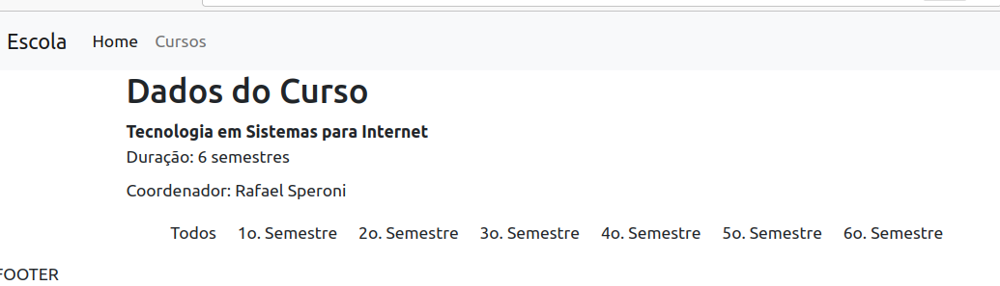

# Parte 2

Na Parte 1, fizemos uma primeira versão de uma página com conteúdo dinâmico, cujos dados estavam armazenados em Arrays.
As páginas dinâmicas foram geradas pelo PHP, que construiu o HTML e fez o envio dos conetúdos "prontos" para o cliente.

Agora, faremos alterações, no sentido de dotar nossas páginas com códigos JS que farão requisições e receberão respostas, e que farão a manipulação das mesmas, alterando as páginas.


## 1. Criando um "endpoint" PHP para cursos

Antes, fizemos com que a página cursos fosse construída completamente pelo PHP, que entregou o HTML pronto para o navegador.
Agora, vamos criar um script que será responsável por entregar uma lista de Cursos ou um único curso, em formato JSON.

JSON (JavaScript Object Notation) é um formato semi-estruturado de dados que possibilita a interoperabilidade entre sistemas, de tal forma que os dados sejam enviados contendo, também, alguma estrutura.

### 1.1 A função **json_encode()** do PHP

O PHP conta com uma fução chamada `json_encode()`, que é capaz de "serializar" dados, ou seja, transformar dados em estruturas próprias (Arrays ou Objetos) em texto, sem perder a sua estrutura.

Verifique o material da aula sobre JSON no SIGAA.

### 1.2 Criando o "endpoint" PHP que retornará dados de curso em JSON

Na pasta do seu projeto, crie uma pasta chamada **api**, e, dentro desta, um arquivo chamado `cursos.php`.
O script `cursos.php` será responsável por obter os dados de UM ou de TODOS OS CURSOS, e retornar os dados em formato JSON. Veja que, agora, não queremos retornar um HTML.

Conteúdo do arquivo `api/dadoscursos.php`
```php
<?php
//este script busca os dados de um curso ou de todos
//inclui o arquivo que contém os dados e as funções getCursos() e getCursoById()
  include_once('../dados.php');

//caso o Query String traga um parâmetro id
if(isset($_GET['id'])){
    //busca o Array com os dados de um curso específico, e codifica em JSON e escreve
    echo json_encode(getCursoPorId($_GET['id']));
}else{ // caso não traga id
    //busca o Array com os dados de todos os cursos, e codifica em JSON e escreve
    echo json_encode(getCursos());
  }
?>
```

Para testar a utilização do script, vá ao navegador, e teste o acesso direto a ele em **http://localhost/.../api/dadoscursos.php** (observe o caminho correto do seu projeto). Deverá ver algo como a imagem abaixo.


Agora, para testar o retorno dos dados de um curso específico, vamos passar um parâmetro id no **Query String**. Para isso, acesse **http://localhost/.../api/dadoscursos.php?id=1** (observe o caminho correto do seu projeto). Deverá ver algo como a imagem abaixo (dados de apenas um curso).


Com isso, conseguimos criar um script PHP, que retorna dados de cursos em formato JSON. E este script funciona tanto para retornar todos os cursos, como um curso específico. Este é um comportamento sobre o qual falaremos mais depois, mas que vai na direção daquilo que se deseja quando se desenvolve na forma de Web Services.

## 2. Alterando a página cursos.php, para que faça requisição Assíncrona

Vamos alterar a PÁGINA `cursos.php`. Trata-se daquela página que exibe os dados dos cursos. Originalmente, criamos esta página de forma que ela tem o seu HTML construído pelo PHP. Agora, desejamos fazer com que o JavaScript faça uma requisição assíncrona (AJAX), e receba os dados em JSON.

Remova o trecho PHP que fazia a montagem das linhas da tabela (dentro de tbody).

Seu arquivo `cursos.php` ficará assim:
```php
<?php
  include('cabecalho.html');
  include('dados.php');
?>
  <main class="container">
      <h2>Lista dos Cursos</h2>
      <table class="table table-striped">
          <thead>
              <th>Id</th>
              <th>Nome</th>
              <th>Semestres</th>
              <th>Coordenador</th>
          </thead>
          <tbody id="tabela-cursos">
              <!-- Aqui vão as linhas com os dados -->

          </tbody>
      </table>
  </main>
<?php
  include('rodape.html');
?>
```

Na pasta do seu projeto, crie uma pasta chamada **js**. Dentro dela, crie um arquivo chamado `cursos.js`. Este será o arquivo JavaScript onde serão desenvolvidas as funções para busca dos dados e manipulação dos resultados.

No arquivo `js/cursos.js`, começaremos criando uma função para o evento **onload** da página. Em outras palavras, estamos indicando o que deve ser executado quando a página terminar de ser carregada.

```javascript
window.onload = function(){
    console.log('terminou de carregar a página');
}
```

Para que a página utilize esse javascript, adicione em `cursos.php`, depois do `</main>`, a tag script, para que possa utilizar o cursos.js.

```php
...
    </table>
  </main>

<script src="js/cursos.js"></script>  
<?php
```

Isto faz com que, ao ser carregada, a página `cursos.php` chame o `js/cursos.js`. Ao completar o carregamento da página, o evento **onload** é executado, e a frase é escrita no console.

Para visualizar o console, acesse a página **cursos.php** do seu projeto no navegador, e tecle F12. Na aba console, você deverá ver uma mensagem assim:


Isto indica que o seu JavaScript está funcionando, ou seja, que ao terminar de carregar a página, o evento onload foi executado, e, consequentemente, uma mensagem foi escrita no console.

Uma vez que o JS está executando, vamos às requisições.

### 2.1. Criando uma função JS para requisição dos dados de Cursos

Já temos:
- Script php `api/dadoscursos.php` que retorna os dados dos cursos em JSON;
- Página `cursos.php`, com a tabela em branco;
- Arquivo `js/cursos.js` executando a função para onload.

Vamos criar uma função para fazer a requisição Assíncrona (AJAX) dos dados.

Em termos simples, queremos que a função JS faça:
1 - Requisição GET para `api/dadoscursos.php`;
2 - Como resposta a essa requisição, receberá dados de todos os cursos, em formato JSON;
3 - Os dados serão percorridos (como um Array);
4 - Para cada curso contido nos dados, criaremos uma linha na tabela HTML da página;

Para fazer a requisição, utilizaremos a fetch API.

No arquivo `js/cursos.js`:
```javascript
function buscaCursos(){
    //funcao que busca os dados em api/cursos.php e monta o HTML na página
    
    fetch('api/dadoscursos.php') //url sendo requisitada
        .then((resposta) => { //pega a resposta no formato json
            return resposta.json();
        })
        .then((dados) => {    //aquela resposta contem dados
            console.log(dados);  //exibe os dados no console
        }); 
    })
    .catch(err => console.error(err)); //caso dê erro, mostra no console
}
//as variaveis resposta e dados poderiam ter outros nomes, a seu gosto, mas assim fica bem explicativo
```

O que temos aqui, é uma requisição assíncrona, utilizando a fetch API. De maneira simplificada, ela é assíncrona, pois ela retorna uma PROMESSA **promise**. Isto quer dizer que não precisa esperar a resolução para fazer outras coisas na sequência. Tem-se ali a promessa de que retornará algo.

Altere o arquivo `js/cursos.js`, acrescentando uma chamada à função recem criada:

```javascript
window.onload = function(){
    console.log('terminou de carregar a página');
    buscaCursos();
}
```

Observe que, agora, além de exibir a mensagem de que a página foi carregada, o console exibirá os dados que retornaram da requisição, tal como se vê na figura abaixo:


Isto indica que houve uma requisição (verifique a aba Network - ou Rede do Navegador) para `api/dadoscursos.php`. Esta requisição retornou um conjunto de dados em JSON, e o seu JavaScript, na página, conseguiu capturá-lo.

O próximo passo é percorrer estes dados, e manipular o documento HTML, incluindo elementos e os dados na forma de linhas de uma tabela.

### 2.2. Manipulando os dados e exibindo no console com JS

Agora, nossa função de busca dos dados, será responsável por fazer a manipulação dos dados recebidos, e acrescentá-los à página HTML `cursos.php`.

Na página `cursos.php`, adicione um id ao elemento **tbody**. 
```html
<tbody id="tabelaCursos">
```

No arquivo `js/cursos.js`, faremos o parse (percorrer) dos dados JSON recebidos, cusando uma estrutura de repetição forEach.

```javascript
function buscaCursos(){
    //funcao que busca os dados em api/cursos.php e monta o HTML na página
    
    fetch('api/dadoscursos.php') //url sendo requisitada
        .then((resposta) => { //pega a resposta no formato json
            return resposta.json();
        })
        .then((dados) => {    //aquela resposta contem dados
            dados.forEach(curso => { //para cada curso contido em dados
                console.log(curso.nome); //exibe o nome do curso
            })
        }); 
    })
    .catch(err => console.error(err)); //caso dê erro, mostra no console
}
```

Estamos dizendo algo como: para cada item dos `dados`, chamando este item de `curso`, exiba no console o nome do curso (`curso.nome`).

Acessando o console em seu navegador, terá algo como:


### 2.3. Exibindo os dados na Página com JS

Já conseguimos exibir os dados no console. Para exibir na página, precisaremos manipular os elementos HTML. Para isto, utilizaremos o DOM (Document Object Model). Com DOM, um documento HTML é visto como um conjunto de objetos estruturados de forma hierárquica, de tal forma que podemos recuperar ou incluir elementos, atributos, textos, em qualquer ponto de um documento.

Lembre-se que o elemento **tbody** de nossa tabela ganhou um ID. Utilizaremos desse ID para recuperar o elemento **tbody**, e, posteriomente, incluir conteúdos dentro dele.

Modifique a função buscaCursos() no arquivo `js/cursos.js`:

```javascript
function buscaCursos(){
    //funcao que busca os dados em api/cursos.php e monta o HTML na página

    //recupera o elemento com id #tabelaCursos, e guarda em uma variável com o mesmo nome
    let tabelaCursos = document.querySelector("#tabelaCursos");

    fetch('api/dadoscursos.php') //url sendo requisitada
        .then((resposta) => { //pega a resposta no formato json
            return resposta.json();
        })
        .then((dados) => {    //aquela resposta contem dados
            dados.forEach(curso => { //para cada curso contido em dados
                console.log(curso.nome); //exibe o nome do curso no console
                let textNome = document.createTextNode(curso.nome); //cria um nó de texto
                tabelaCursos.appendChild(textNome); //adiciona o nó de texto dentro do elemento #tabelaCursos
            })
        }) 
        .catch(err => console.error(err)); //caso dê erro, mostra no console
}
```

Acesse agora a página `cursos.php`, e verifique que os nomes dos cursos foram criados dentro do **tbody** da tabela.

A figura abaixo apresenta o resultado na página. À direita, no inspetor de códigos, é possível ver os conteúdos de texto gerados dentro do **tbody**.


No próximo passo, precisamos melhorar essa estrutura da tabela. Lembre-se que uma tabela HTML contém linhas (`<tr>`). As linhas contém células (`<td>`). E as células contém nós de texto (`textNode`).

Assim, precisamos fazer com que a função crie esta estrutura para cada curso. Iniciaremos criando uma linha com uma célula para cada nome de curso:

Portanto, o arquivo `js/cursos.js` ficará, agora:

```javascript
function buscaCursos(){
    //funcao que busca os dados em api/cursos.php e monta o HTML na página

    //recupera o elemento com id #tabelaCursos, e guarda em uma variável com o mesmo nome
    let tabelaCursos = document.querySelector("#tabela-cursos");

    fetch('api/dadoscursos.php') //url sendo requisitada
        .then((resposta) => { //pega a resposta no formato json
            return resposta.json();
        })
        .then((dados) => {    //aquela resposta contem dados
            dados.forEach(curso => { //para cada curso contido em dados
                console.log(curso.nome); //exibe o nome do curso no console
                let tr = document.createElement("tr"); //cria um tr
                let tdnome = document.createElement("td"); //cria um td
                let textnome = document.createTextNode(curso.nome); //cria um nó de texto
                tdnome.appendChild(textnome); //adiciona o nó de texto dentro do td
                tr.appendChild(tdnome); //adiciona o td dentro do tr
                tabelacursos.appendChild(tr); //adiciona o tr dentro da tabela
            })
        }); 
    })
    .catch(err => console.error(err)); //caso dê erro, mostra no console
}
```

A imagem abaixo apresenta os nomes dentro da tabela, cada um em uma linha (observe que já tem cor de fundo para linhas alternadas). No inspetor de código é possível observar a estrutura de trs e tds criadas na tabela.


Na sequência, é necessário criar mais células, uma para id, uma para semestres, e uma para o coordenador.

### 2.3.1. Adicionando as outras colunas (id, semestres e coordenador)

Da mesma forma como fizemos com o nome do curso, desejamos que cada linha da tabela contenha 4 colunas. Assim, precisamos incluir uma célula (`<td>`) antes daquela que criamos para o nome do curso. Considerando que os dados retornados em JSON trazem todos os dados de todos os cursos, devemos lembrar que:
* os dados retornados em json estão em um array;
* cada posição desse array contém um objeto, que representa cada curso;
* em um `foreach`, acessamos o nome do curso na propriedade `curso.nome`;

Portanto, temos disponíveis, ainda, `curso.id`, `curso.semestres` e `curso.coordenador`.

Vamos alterar a função `buscaCursos()` no arquivo `cursos.js`. Dentro do `foreach()` dessa função, teremos, então:

```javascript
...
                //DOM - Document Object Model
                let tr = document.createElement("tr");
                //cria uma célula para o id, dentro dela um nó de texto, e dentro do nó um valor - adiciona célula na linha
                let tdid = document.createElement("td");
                let textid = document.createTextNode(curso.id);
                tdid.appendChild(textid);
                tr.appendChild(tdid);

                //cria uma célula para o id, dentro dela um nó de texto, e dentro do nó um valor - adiciona célula na linha
                let tdnome = document.createElement("td");
                let textnome = document.createTextNode(curso.nome);
                tdnome.appendChild(textnome);
                tr.appendChild(tdnome);

                //cria uma célula para o id, dentro dela um nó de texto, e dentro do nó um valor - adiciona célula na linha
                let tdsemestres = document.createElement("td");
                let textsemestres = document.createTextNode(curso.semestres);
                tdsemestres.appendChild(textsemestres);
                tr.appendChild(tdsemestres);

                //cria uma célula para o id, dentro dela um nó de texto, e dentro do nó um valor - adiciona célula na linha
                let tdcoord = document.createElement("td");
                let textcoord = document.createTextNode(curso.coordenador);
                tdcoord.appendChild(textcoord);
                tr.appendChild(tdcoord);

                //adiciona a linha na tabela
                tabelacursos.appendChild(tr);
...
```

Com estas alterações, a página ficou conforme apresenta a figura:


### 2.4. Melhorando a qualidade dos dados

Vimos que foi possível retornar, como JSON, os dados dos cursos. Todavia, percebemos que trouxemos apenas o **id** do coordenador. O nome deste professor está em outro conjunto de dados.

Podemos melhorar os dados a serem retornados em nosso JSON do `dadoscursos.php`, de tal forma que já tragam também o nome do professor coordenador.

Em outras palavras, queremos que o JSON a ser retornado traga elementos um pouco mais complexos.
Em vez de termos o JSON assim:

```javascript
[
...
    {
        "id":1,
        "nome":"Tecnologia em Sistemas para Internet",
        "semestres":6,
        "coordenador":5
    },
    {
        "id":2,
        "nome":"Bacharelado em Sistemas de Informação",
        "semestres":8,
        "coordenador":3
    },
    {
        "id":3,
        "nome":"Técnico em Informática Integrado",
        "semestres":6,
        "coordenador":2
    }
...
]
```

Queremos um JSON assim, onde a propriedade `coordenador` de cada curso contenha um **objeto** com os dados do professor.

```javascript
[
...
    {
        "id":1,
        "nome":"Tecnologia em Sistemas para Internet",
        "semestres":6,
        "coordenador":{
            "id":5,
            "nome":"Rafael Speroni"
        }
    },
    {
        "id":2,
        "nome":"Bacharelado em Sistemas de Informação",
        "semestres":8,
        "coordenador":{
            "id":3,
            "nome":"Daniel Anderle"
        }
    },
    {
        "id":3,
        "nome":"Técnico em Informática Integrado",
        "semestres":6,
        "coordenador":{
            "id":2,
            "nome":"Ângelo Frozza"
        }
    }
...
]
```
Desta forma, vamos alterar a função `getCursos()` em `api/dadoscursos.php`, de forma que ela retorne um Array modificado, mais completo, com os dados dos professores.

#### 2.4.1. Alterando a funçao getCursos()

Vamos alterar essa função, fazendo com que o Array de cursos a ser retornado passe a conter, em vez de apenas o **id** do coordenador, um **objeto** contendo os dados do professor coordenador.

No arquivo `dados.php`, vamos percorrer o Array `$cursos`, e alterar o valor da propriedade `coordenador` de cada curso. Vamos guardar nessa posição o Array do professor correspondente:

```php
function getCursos(){
    global $cursos; //a funcao passa a "conhecer" a variavel definida fora
    //percorre cada posição do array
    for($i=0; $i<sizeof($cursos); $i++){
        //busca o professor correspondente, recebe o Array
        $coordenador = getProfessor($cursos[$i]['coordenador']);
        //substitui o valor da posição coordenador pelo Array
        $cursos[$i]['coordenador'] = $coordenador;
    }    
    return $cursos;
}
```
Observe agora, no inspector, a requisição que é feita para `api/dadoscursos.php`, e veja que o JSON retornado na requisição está modificado, sendo que `coordenador` não tem apenas um **id**, e sim um **Objeto** que contem **id** e **nome** do professor.


Podemos, então, alterar a função `buscaCursos()` em `cursos.js`, de forma a alterar o que é exibido na última coluna da tabela.

Antes, exibiamos `curso.coordenador`. Agora, essa propriedade contém um **Objeto**, que tem propriedade **id** e **nome**. Desejamos mostrar o nome, que está em `curso.coordenador.nome`:
```javascript
// cursos.js
// função buscaCursos()
...
                let tdcoord = document.createElement("td");
                let textcoord = document.createTextNode(curso.coordenador.nome);
                tdcoord.appendChild(textcoord);
                tr.appendChild(tdcoord);
...
```

E, então, a página `cursos.php` será apresentada conforme segue:


### 2.4.2. Alterando a função getCursoPorId()

De forma semelhante ao que fizemos na função `getCursos()`, no `dados.php`, faremos a alteração na função `getCursoPorId()`

A alteração consiste em alterar o valor contido na propriedade `coordenador`, passando a constar ali não apenas o id, mas o array completo do professor.

```php
function getCursoPorId($id_curso){
    global $cursos;

    $cursoRetorno = array();

    foreach($cursos as $curso){ //para cada 
        if($curso['id'] == $id_curso){
            //substitui o id pelo array do professor retornado
            $curso['coordenador'] = getProfessor($curso['coordenador']);
            $cursoRetorno = $curso;
        }
    }
    //retorna o array de curso 
    return $cursoRetorno;
}
```

## 3. A página de professor.php

Tal qual fizemos com a página que lista os cursos, vamos alterar a página `professor.php`, de forma que o PHP a página seja carregada em sua estrutura básica, e os dados sejam carregados por meio de uma requisição AJAX, usando o `fetch()`.

### 3.1. Criação do link no nome do professor

Queremos fazer com que os nomes dos professores, na página `cursos.php`, sejam transformados em links. Todavia, temos que observar que, nesta versão da página os conteúdos da tabela foram gerados via Javascript, pela manipulação do DOM, ou seja, a criação dos elementos e seu posicionamento no documento foi feito na função Javascript `buscaCursos()` no `cursos.js`.

Queremos alterar o conteúdo da célula (`<td>`) correspondente ao nome do Coordenador do curso, acrescentando um link (`<a href>`).

```javascript
...
                let tdcoord = document.createElement("td");
                let linkcoord = document.createElement("a");
                let textcoord = document.createTextNode(curso.coordenador.nome);
                linkcoord.appendChild(textcoord);
                linkcoord.setAttribute("href", "#");
                linkcoord.setAttribute("onclick", "linkProfessor(this)");
                linkcoord.setAttribute("data-coord", curso.coordenador.id);
                tdcoord.appendChild(linkcoord);
                tr.appendChild(tdcoord);
...                
```
Descrevendo o código, temos:
* criação do elemento célula (`<td>`), que chamaremos `tdcoord`;
* criação do elemento link (`<a>`), que chamaremos `linkcoord`;
* criação do "nó de texto", que chamaremos `textcoord`, contendo o valor do nome a exibir;
* adiciona o `textcoord` dentro do `linkcoord`, fazendo com que crie algo como `<a>Rafael Speroni</a>`;
* adiciona um atributo `href="#"` ao `linkcood`, fazendo com que crie algo como `<a href="#">Rafael Speroni</a>`;
* adiciona um atributo `data-coord` com o valor do id do professor ao `linkcoord`, fazendo com que se crie algo como `<a href="#" data-coord="1">Rafael Speroni</a>`; 
* adiciona um atributo `onclick="linkProfessor(this)"`, fazendo com que se crie algo como `<a href="#" data-coord="1" onclick="linkProfessor(this)">Rafael Speroni</a>`;
* adiciona o link `linkcoord` à celula `tdcoord`;
* adiciona a célula `tdcoord` à linha da tabela `<tr>`;

Isto fará com que o nome do professor seja exibido na forma de uma **célula da tabela (td)**, que contém um link **<a>**, que aponta para a própria página **href="#"**, que ao ser clicado chama uma função **linkProfessor(this)**, e que tem o id do professor armazenado no atributo **data-coord**;

Visualize sua página no navegador, e verifique se os links foram criados. Inspecione o elemento do nome, e verifique se o HTML foi gerado corretamente, conforme exemplo da figura abaixo:


Uma vez que tenha criado os links, eles ainda não funcionam. Observe no console javascript que o erro indica que a função `linkProfessor()` não está definida. De fato, ainda não foi criada.


### 3.2. Criação da função linkProfessor()

Ainda no arquivo `js/cursos;js`, queremos criar esta função que é chamada quando o link for clicado.

```javascript
function linkProfessor(coord){
    var id = coord.getAttribute('data-coord');
    window.location.href = "professor.php?id="+id;
}
```
Observe que ela vai pegar o valor contido em `data-coord`, e utilizá-lo para redirecionar para a página professor.php, com parâmetro id na queryString.

## 4. Criação de um Endpoint para Professores

Este é um arquivo PHP que faz papel de backend. Ao receber uma requisição GET, com um id de professor, retornará um JSON com os dados do referido professor.

Na pasta `api`, crie o `dadosprofessores.php`
```php
<?php
header('Content-Type: application/json');
include('../dados.php');

if(isset($_GET['id'])){
    echo json_encode(getProfessor($_GET['id']));
}else{
    echo "id não definido";
}
```
Neste primeiro momento, o script somente funcionará para os casos em que seja enviado um **id** de professor no **queryString**. Por exemplo, teríamos uma requisição para algo como `http://localhost/..../api/dadosprofessores.php?id=1`;

Portanto, o que fazemos é testar se há um valor de **id** enviado na **queryString**. Caso afirmativo, chamamos a função `getProfessor()`, que está definida em `dados.php`, e exibimos o seu retorno, codificando em JSON.

Observe que a primeira linha altera o **Content-type**, ou seja, indica que o tipo de conteúdo retornado por esta página não é o padrão (text/html), e sim **application/json**.

Desta forma, se testarmos o acesso direto ao link `http://localhost/..../api/dadosprofessores.php?id=1`, teremos como resposta o JSON com os dados de um professor, tal qual exemplificado na imagem que segue:


Queremos, portanto:
* Alterar a página `professor.php`, de forma que o conteúdo correspondente ao professor esteja vazio, para ser preenchido via AJAX;

* Criar uma função javascript que faça uma requisição AJAX, usando fetch(), a este `api/dadosprofessores.php`, e que seja capaz de tratar sua resposta, apresentando os dados na página.

### 4.1. Alteração da página professor.php

A página `professor.php` será alterada, de forma q remover aqueles conteúdos de professor que eram gerados pelo PHP. Deseja-se, que este conteúdo venha vazio, e depois seja preenchido pelo javascript, em uma requisição AJAX.

Código da página `professor.php`:
```php
<?php
include ('cabecalho.html');
?>
<main class="container">
    <h2>Dados do Professor</h2>
    <!-- Aqui serão apresentados os dados do professor -->
    <dl>
      <dt id="nomeprofessor"></dt>
      <dd id="descrprofessor"></dd>
    </dl>

</main>
<script src="js/professor.js"></script>
<?php
include ('rodape.html');
?>
```

Observe que foram removidos os trechos PHP que geravam os conteúdos centrais da página.
A nova **lista de definição HTML (`<dl>`)**, passa a conter dois elementos, identificados e vazios:
* `<dt id="nomeprofessor">`: título - onde será adicionado o nome do professor;
* `<dd id="descrprofessor">`: definição (descrição) - onde serão exibidos detalhes do professor.

Observe, ainda, que há uma indicação de que o script `js/professores.js` será invocado.

### 4.2. Criação do script js/professores.js

Agora, criaremos um arquivo javacript para tratar dos dados de professores.

Queremos criar uma função que:
* receba um id de professor;
* faça uma requisição HTTP para um PHP que responda com um JSON

```javascript
//estas duas linhas fazem com que recuperemos os parâmetros enviados na queryString
const urlSearchParams = new URLSearchParams(window.location.search);
const params = Object.fromEntries(urlSearchParams.entries()); //params será um objeto javascript, contendo todos os parâmetros enviados na quueryString

//a função que recebe um id, faz a requisição ao endpoint PHP, recebe o JSON e exibe os dados na página
function buscaProfessor(idProfessor){
    var nomeprofessor = document.querySelector("#nomeprofessor");
    var descrprofessor = document.querySelector("#descrprofessor");
    fetch('api/dadosprofessores.php?id='+idProfessor)
        .then(response => {
            return response.json();
        })
        .then(dados => {
            console.log(dados); //apenas para controle
            nomeprofessor.innerHTML = dados.nome; //insere conteúdo no elemento
            descrprofessor.innerHTML = "Para contactar o professor, envie e-mail para "+dados.email; //insere conteúdo no elemento
        });
}

//execução principal - ao carregar a página
window.onload = function(){
    console.log(params); //exibe os parâmetros no console (apenas para entendimento)
    buscaProfessor(params.id); //invoca a função, com o id do professor que veio na queryString
  }

```

## 5. A página curso.html

Agora, a página `curso.php` será alterada, de forma semelhante à que fizemos com `professor.php`. Em outras palavras, teremos um link no nome de cada curso, e uma página irá detalhar este curso.

Para demonstrar que não estamos fazendo o PHP construir o HTML, faremos a alteração da extensão do arquivo, e removeremos dele qualquer menção ao PHP.

### 5.1. Criando links nos nomes dos cursos em cursos.php

De forma semelhante ao que fizemos nos nomes dos professores, queremos transformar os nomes de cursos em links. Estes links devem apontar para a página `cursos.html`, passando o id via queryString.

O arquivo `js/cursos.js` é alterado para a criação do link no nome do curso:
```javascript
...
                let tdnome = document.createElement("td");
                let linknome = document.createElement("a");
                let textnome = document.createTextNode(curso.nome);
                linknome.appendChild(textnome);
                linknome.setAttribute("onclick", "linkCurso(this)");
                linknome.setAttribute("data-curso", curso.id);
                linknome.setAttribute("href", "#");
                tdnome.appendChild(linknome);
                tr.appendChild(tdnome);
...
```
Esta alteração é bem semelhante ao que fizemos para exibir o link no nome do professor.

Ainda em `js/cursos.js`, também será necessário criar a função `linkCurso()`, que irá redirecionar para  página `curso.html`:
```javascript
function linkCurso(curso){
    var id = curso.getAttribute('data-curso');
    window.location.href = "curso.html?id="+id;
}
```

### 5.2. Renomeando o arquivo cursos.php

Abra o `curso.php` em seu editor e salve como (Arquivo - Salvar como...  ou  File - Save as...)`curso.html`.

#### 5.1.1. Removendo os trechos PHP

Vamos remover os trechos PHP que fazem include em `cabecalho.html` e `rodape.html`.
Com isso, será necessário que aqueles conteúdos do cabecalho e rodape sejam colocados como HTML nesta página.

O `curso.html`:

```html
<!DOCTYPE html>
<html lang="en">
<head>
    <meta charset="UTF-8">
    <meta http-equiv="X-UA-Compatible" content="IE=edge">
    <meta name="viewport" content="width=device-width, initial-scale=1.0">
    <title>Document</title>
    <!-- CSS Bootstrap -->
    <link href="https://cdn.jsdelivr.net/npm/bootstrap@5.1.1/dist/css/bootstrap.min.css" rel="stylesheet" integrity="sha384-F3w7mX95PdgyTmZZMECAngseQB83DfGTowi0iMjiWaeVhAn4FJkqJByhZMI3AhiU" crossorigin="anonymous">
    <link rel="stylesheet" href="css/cursos.css">
</head>
<body>
    <header>
        <nav class="navbar navbar-expand-lg navbar-light bg-light">
            <div class="container-fluid">
              <a class="navbar-brand" href="#">Escola</a>
              <button class="navbar-toggler" type="button" data-bs-toggle="collapse" data-bs-target="#navbarSupportedContent" aria-controls="navbarSupportedContent" aria-expanded="false" aria-label="Toggle navigation">
                <span class="navbar-toggler-icon"></span>
              </button>
              <div class="collapse navbar-collapse" id="navbarSupportedContent">
                <ul class="navbar-nav me-auto mb-2 mb-lg-0">
                  <li class="nav-item">
                    <a class="nav-link active" aria-current="page" href="#">Home</a>
                  </li>
                  <li class="nav-item">
                    <a class="nav-link" href="cursos.php">Cursos</a>
                  </li>
                </ul>
              </div>
            </div>
          </nav>        
    </header>
    <main class="container">
        <h2>Dados do Curso</h2>
        <!-- Aqui serão apresentados os dados do curso -->
        <dl>
          <dt id="nomecurso"></dt>
          <dd id="semcurso"></dd>
          <dd id="coordcurso"></dd>
        </dl>
    </main>
    <script src="js/curso.js"></script>
    <script>
    
    </script>
<footer>FOOTER</footer>
<!-- JavaScript Bootstrap -->
<script src="https://cdn.jsdelivr.net/npm/bootstrap@5.1.1/dist/js/bootstrap.bundle.min.js" integrity="sha384-/bQdsTh/da6pkI1MST/rWKFNjaCP5gBSY4sEBT38Q/9RBh9AH40zEOg7Hlq2THRZ" crossorigin="anonymous"></script>
</body>
</html>
```

Observe que, agora, trata-se de uma página HTML, e só. Ela contém o cabeçalho, o conteúdo principal e o rodapé.

Foi criada, também, uma **lista de definição HTML (`<dl>`)**, para a exibição dos detalhes do curso, bem como os elementos vazios e identificados para o nome, semestres e coordenador.

### 5.3. O endpoint de cursos

Lembre-se que o arquivo `api/dadoscursos.php` é o responsável, no back-end, por entregar os dados de curso. Vá até ele e verifique que há um teste.
Se não for enviado um **id** no queryString, retorna os dados de todos os cursos. Se for enviado um **id** no queryString, retorna os dados de um curso.
Isso signfica que este endpoint já está preparado para funcionar caso seja feita uma requisição como `http://localhost/..../api/dadoscursos.php?id=1`, o retorno sserá semelhante ao da figura abaixo:


Portanto, não há necessidade de modificar este endpoint agora.

### 5.4. O script js/curso.js

De forma semelhante ao que fizemos em `js/professor.js`, queremos criar um script `js/curso.js`, onde:
* recebe os parâmetros do queryString
* define a função buscaCurso
* onload: ao carregar a página, invoca a função buscaCurso() com o id passado por parâmetro:

Crie o script `js/curso.js`
```javascript
const urlSearchParams = new URLSearchParams(window.location.search);
const params = Object.fromEntries(urlSearchParams.entries());

function buscaCurso(idCurso){
    var nomeCurso = document.querySelector("#nomecurso");
    var semCurso = document.querySelector("#semcurso");
    var coordCurso = document.querySelector("#coordcurso");
    fetch('api/dadoscursos.php?id='+idCurso)
        .then(response => {
            return response.json();
        })
        .then(dados => {
            console.log(dados);
            nomeCurso.innerHTML = dados.nome;
            semCurso.innerHTML = "Duração: " + dados.semestres + " semestres";
            coordCurso.innerHTML = "Coordenador: " + dados.coordenador.nome;

        });
}

window.onload = function(){
    console.log(params);
    buscaCurso(params.id);

  }
```

## 6. Apresentando as disciplinas de um curso

Nesta seção, vamos alterar a página `curso.html`, incluindo um conjunto de links, pelos quais poderemos filtrar as disciplinas por semestre.

### 6.1. Criando a lista de links por semestre

Pretendemos criar:
* Uma div para posicionar os links;
* Uma div para posicionar a lista de disciplinas;
* Um link para "Todas" as disciplinas;
* Um link para cada semestre do curso;

Vamos, portanto, criar uma div na página `curso.html`, logo após as informações básicas do curso:
```html
...
        </dl>
        <div id="links"></div>
        <div id="disciplinas"></div>
    </main>
...    
```

Criamos duas divs vazias, para que sejam preenchidas pelo Javascript.

Inicialmente, vamos criar uma função javascript para listar os semestres, no arquivo `curso.js`:
```javascript
//função que cria um conjunto de links dos semestres para filtrar disciplinas
function linksSemestres(semestres){
    let links = document.querySelector("#links");
    let ul = document.createElement("ul");
    let li = document.createElement("li");
    let txt = document.createTextNode("Todos");
    li.appendChild(txt);
    ul.appendChild(li);
    links.appendChild(ul);
}
```
Até o momento, estamos fazendo uma função que:
* seleciona o elemento #links (a div que foi criada anteriormente);
* cria um elemento `<ul>` (lista não ordenada);
* cria um elemento `<li>` (item de lista);
* cria um texto "Todos";
* adiciona o texto ao elemento `<li>`;
* adiciona o elemento `<li>` à lista `<ul>`;
* adiciona a lista `<ul>` à div #links;

Ainda no arquivo `curso.js`, vamos fazer com que a mesma função que buscou os dados do curso, e que escreveu os dados básicos na página, invoque a nossa função recém criada `linksSemestres()`:
```javascript
...
        .then(dados => {
            console.log(dados);
            nomeCurso.innerHTML = dados.nome;
            semCurso.innerHTML = "Duração: " + dados.semestres + " semestres";
            coordCurso.innerHTML = "Coordenador: " + dados.coordenador.nome;
            
            //invoca a função que vai criar os links
            linksSemestres(dados.semestres);
        });
...
```
Ou seja, depois de escrever os dados principais do curso (nome, tempo de conclusão, coordenador), chamamos a função responsável por criar os links de semestres. Até o momento, a função `linkSemestres()` cria apenas um item "Todos".

Acesse a página de um curso, e deverá ter algo como a figura abaixo:


Dando continuidade, vamos alterar a função `linksSemestres()`, para que gere os textos dos demais semestres. Faremos isso com uma estrutura de repetição (de 1 até o número de semestres):
```javascript
//função que cria um conjunto de links dos semestres para filtrar disciplinas
function linksSemestres(semestres){
    let links = document.querySelector("#links");
    let ul = document.createElement("ul");
    let li = document.createElement("li");
    let txt = document.createTextNode("Todos");
    li.appendChild(txt);
    ul.appendChild(li);
    //Gera os <li> com 1, 2, 3... semestre
    for (let i = 1; i <= semestres; i++) {
        let li = document.createElement("li");
        let txt = document.createTextNode(i + "o. Semestre");
        li.appendChild(txt); 
        ul.appendChild(li);           
    }
    links.appendChild(ul);
}
```

Com essa estrutura de repetição `for`, estamos criando um elemento `<li>` com um texto para cada um dos numeros de semestre.


Vamos adicionar algumas regras de CSS em `css/cursos.css`, para que esta lista `<ul>` seja apresentada com seus itens lado-a-lado.

Crie a pasta `css`. Dentro dela, crie o arquivo `cursos.css`:

```css
//
#links ul {
    display: flex;
}

#links ul li{
    list-style-type: none;
    margin: 0 10px;
}
```
Alteramos a exibição do `<ul>` para `flex`, e os `<li>` para que fiquem sem o marcador e acrescentamos uma margem para separar os itens. As alterações deverão fazer com que os itens fiquem conforme a imagem:



Antes de fazermos com que os semestres sejam clicáveis, vamos criar o endpoint (back-end PHP) para gerar dados JSON das disciplinas. E também vamos criar uma função javascript (front-end) para fazer a requisição por esses dados.

**Precisaremos:** 

* No arquivo dados.php, criar uma função para selecionar as disciplinas do Array `$disciplinas`;
* No arquivo `api/dadosdisciplinas.php`, receber requisições com parâmetros na queryString, e invocar a função que seleciona as disciplinas;
* No arquivo `js/curso.js`, criar uma função que fará a requisição AJAX, e apresentará os dados das disciplinas na página.

### 6.2. O endpoint de disciplinas

De forma semelhante como fizemos com cursos e professores, vamos criar um endpoint para responder às solicitações por dados de disciplinas.

Criar uma função no arquivo `dados.php`:
```php
//função recebe o id do curso e o semestre
//caso seja passado o semestre 0, mostrar disciplinas de todos os semestres
function getDisciplinas($id_curso, $semestre){
    global $disciplinas;
    //cria um array para as disciplinas selecionadas
    $discSelecionadas = array();
    foreach($disciplinas as $disciplina){
        //testa se é disciplina do curso
        if ($disciplina['id_curso'] == $id_curso){
            //se for o semestre informado, ou se informar zero
            if (($disciplina['semestre'] == $semestre) ||
                ($semestre == 0)){
                    //adiciona esta disciplina ao array das selecionadas
                    array_push($discSelecionadas, $disciplina);
                }
        }
    }
    //retorna o array criado, contendo as selecionadas
    return $discSelecionadas;
}
```
Perceba que, nesta função, precisamos criar um novo array, para que pudessemos incluir nele as disciplinas que queremos selecionar.
O array foi criado vazio (`$discSelecionadas = array()`), e depois, a depender dos testes feitos com os valores, os cursos são adicionados ao array, com a função `array_push()`.
Ao final, o array gerado é retornado como resultado da função.

Para testá-la, vamos ao endpoint, que será o arquivo que responderá às requisições para revolver os dados.

Queremos criar um endpoint que:
* Receba parâmetros **id_curso** e **semestre** (via queryString);
* id_curso será usado para filtrar disciplinas por curso;
* semestre será usado para filtras as disciplinas por semestre, se vier ZERO, ou não vier o parâmetro semestre, entendemos como ZERO, indicando que são TODAS as disciplinas do curso.

Vamos criar um arquivo `api/dadosdisciplinas.php`:

```php
<?php
<?php
include_once('../dados.php');

if(isset($_GET['id_curso'])){
    $id_curso = $_GET['id_curso'];
    if(isset($_GET['semestre'])){
        $semestre = $_GET['semestre'];
    }else{
        $semestre = 0;
    }
    $disciplinas = getDisciplinas($id_curso, $semestre);
    echo json_encode($disciplinas);
}else{//caso não venha o parâmetro id_curso
    $msg = array("erro" => "Não é possível acessar");
    echo json_encode($msg);
}
```

Para testar, acesse em seu navegador `http://localhost/...../api/dadosdisciplinas.php`. Como não está enviando o id_curso no queryString, a mensagem retornada é a de erro, que criamos.

Acessando `http://localhost/...../api/dadosdisciplinas.php?id_curso=1`, deverá retornar um JSON contendo dados de todas as disciplinas do curso 1:


Já acessando `http://localhost/...../api/dadosdisciplinas.php?id_curso=1&semestre=2`, deverá retornar um JSON contendo os dados das disciplinas do semestre 2 do curso 1:


### 6.3. A função Javascript que faz a requisição dos dados de disciplina

Nosso objetivo é que a página de detalhes de um curso apresente os dados de suas disciplinas.
Portanto, vamos criar uma função para fazer a requisição HTTP ao endpoint de disciplinas.
No arquivo `js/curso.js`:
```javascript
function listaDisciplinas(id_curso, semestre){
    //seleciona a div e limpa o seu conteúdo
    let divDisciplinas = document.querySelector("#disciplinas");
    divDisciplinas.innerHTML = "";
    //requisição AJAX
    fetch("api/dadosdisciplinas.php?id_curso="+id_curso+"&semestre="+semestre)
    .then(response => {
        //pega a resposta como json
        return response.json();
    })
    .then(disciplinas => {
        //exibe no console os dados retornados 
        console.log(disciplinas);
    })
}
```
Até aqui, nossa função vai exibir os dados no console.

Vamos alterar a função javascript `buscaCursos()`, para que a mesma, além de invocar a função que cria os links de semestres, invoque a função `listaDisciplinas()`.

Altere a função `buscaCursos()` em `js/curso.js`, acrescentando:
```javascript
...
    //ainda dentro do .then(dados=> {
            //invoca a função que cria os links de semestres
            linksSemestres(dados.id, dados.semestres);
            //invoca a função que faz requisição das disciplinas
            //usa o id do curso, e semestre 0 (todos)
            listaDisciplinas(dados.id, 0);
...
```
Observe em seu console javascript, que os dados resultantes da requisição AJAX para `api/dadosdisciplinas.php` devem ter sido apresentados:


Até o momento, os dados foram retornados, mas não apresentados na página. Logo, vamos fazer com que os mesmos sejam exibidos na página. Para isto, precisamos percorrer (com forEach) os dados das disciplinas, incluindo os mesmos no HTML da página.

Em `js/curso.js`, altere a função `listaDisciplinas()`:
```javascript
    ...
    .then(disciplinas => {
        //exibe no console os dados retornados 
        console.log(disciplinas);
        //percorre o array de disciplinas retornado
        disciplinas.forEach(disciplina => {
            //cria uma linha de tabela
            let tr = document.createElement("tr");
            //cria uma coluna de tabela
            let td = document.createElement("td");
            //cria um nó de texto
            let txn = document.createTextNode(disciplina.nome);
            //adiciona o nó de texto na coluna
            td.appendChild(txn);
            //adiciona a coluna na linha
            tr.appendChild(td);
            //adiciona a linha à div
            divDisciplinas.appendChild(tr);
        });
    ...
```


Observe que, para cada disciplina, uma linha e uma coluna de tabela é criada, e adicionada à div selecionada. No HTML, podemos alterar essa div para uma table, e vamos fazê-la com a classe `table-striped`, para que tenhas as linhas com cores alternadas.

Em `curso.html`, vamos alterar:
```html
...
        <div class="tab-content">
          <div id="links"></div>
          <table class="table table-striped">
            <tbody id="disciplinas"></tbody>
          </table>
        </div>
...
```


Agora, vamos acrescentar mais uma coluna, com a ementa. Altere a função `listaDisciplinas()` em `js/curso.js` e acrescente outra célula (`<td>`) com a ementa (`disciplina.ementa`):
```javascript
    ...
        //percorre o array de disciplinas retornado
        disciplinas.forEach(disciplina => {
            //cria uma linha de tabela
            let tr = document.createElement("tr");
            //cria uma coluna de tabela
            let td = document.createElement("td");
            //cria um nó de texto
            let txn = document.createTextNode(disciplina.nome);
            //adiciona o nó de texto na coluna
            td.appendChild(txn);
            //adiciona a coluna na linha
            tr.appendChild(td);
        /////coluna para a ementa////
            //cria uma coluna de tabela
            let tdementa = document.createElement("td");
            //cria um nó de texto
            let txnementa = document.createTextNode(disciplina.ementa);
            //adiciona o nó de texto na coluna
            tdementa.appendChild(txnementa);
            //adiciona a coluna na linha
            tr.appendChild(tdementa);
        /////////////////////////////
            //adiciona a linha à div
            divDisciplinas.appendChild(tr);
        });
    ...
```
Acessando a página, temos:


### 6.4. Filtrando as disciplinas por semestre

Até o momento, temos a lista de semestres na parte superior do conteúdo, mas ainda não funcionam como links.
Pretendemos, agora, alterar a função que gera essa lista, de forma que os números de semestres tornem-se links, e sejam apresentados como abas, para que possamos filtrar as disciplinas.

Para a criação de abas, vamos aplicar à lista dos semestres um conjunto de estilos do Bootstrap ([exemplo aqui](https://getbootstrap.com/docs/5.0/components/navs-tabs/#javascript-behavior)){:target=_blank}

Vamos, então, alterar a função `linksSemestres()`, para que a lista (`<ul>`) seja gerada com os estilos do Bootstrap.

Em `js/curso.js`, na função `linksSemestres()`:
```javascript
//função que cria um conjunto de links dos semestres para filtrar disciplinas
function linksSemestres(id_curso, semestres){
    //encontra a div onde será escrita a lista
    let links = document.querySelector("#links");
  //criaçao da aba "Todos"  
    //cria o elemento <ul>
    let ul = document.createElement("ul");
    //cria o elemento <li>
    let li = document.createElement("li");
    //cria o link <a>
    let a = document.createElement("a");
    //acrescenta um atributo class em ul: <ul class="nav nav-tabs>" - são classes do Bootstrap
    ul.setAttribute('class', 'nav nav-tabs')
    //acrescenta um atributo data-bs-toggle em <li>: <li data-bs-toggle="tab"> - para o comportamento de alterar a aba selecionada
    li.setAttribute("data-bs-toggle", "tab")
    //acrescenta um atributo class em <a>: <a class="nav-link active"> - são classes do Bootstrap (active indica que essa aba vem selecionada)
    a.setAttribute("class", "nav-link active");
    //cria um atributo onclick, para invocar a função que busca as disciplinas
    li.setAttribute("onclick", "listaDisciplinas("+id_curso+", 0)")
    //cria um nó de texto, contento a palavra "Todos"
    let txt = document.createTextNode("Todos");
    //acrescenta o nó de texto ao link <a>
    a.appendChild(txt);
    //acrescente o link ao <li>
    li.appendChild(a);
    //acrescenta o <li> ao <ul>
    ul.appendChild(li);
    //Gera os <li> com 1, 2, 3... semestre
    //faz a geração dos elementos e estilos tal qual fizemos para "Todos"
    for (let i = 1; i <= semestres; i++) {
        let li = document.createElement("li");
        let a = document.createElement("a");
        let txt = document.createTextNode(i + "o. Semestre");
        li.setAttribute('class', 'nav-item');
        a.setAttribute("class", "nav-link")
        a.setAttribute("data-bs-toggle", "tab")
        //adiciona o atributo onclick, para invocar a função que busca as disciplinas
        li.setAttribute("onclick", "listaDisciplinas("+id_curso+", "+ i +")");
        a.appendChild(txt); 
        li.appendChild(a);
        ul.appendChild(li);           
    }
    //adiciona a lista <ul> à div selecionada
    links.appendChild(ul);
}
```

Acessando a página, verifique que as abas foram estilizadas, e os links disparam novas requisições. Além disso, as abas ficam selecionadas, de acordo com a que foi clicada:


Com isso, encerramos a parte 2 deste roteiro.
A parte 3 necessitará que você tenha chegado até aqui. Nela, passaremos a utilizar um Banco de Dados. Precisaremos alterar as funções que manipulam os dados, e pretendemos que não seja necessário realizar maiores modificações nas páginas.
Assim, poderemos identificar a importância do entendimento da separação entre front-end e back-end.