# Parte 3. - Adicionando um Banco de Dados ao projeto

Nesta etapa, vamos transformar nosso projeto em um site cujos dados estarão armazenados em um Banco de Dados.
Vamos utilizar:
* Back-end:
    * PDO (PHP Data Objects): é uma extensão do PHP que define uma interface leve e consistente para acesso a bancos de dados [PDO - Documentação](https://www.php.net/manual/pt_BR/intro.pdo.php);
    * SQLite: É uma biblioteca feita na linguagem C, que implementa um mecanismo de banco de dados SQL pequeno, rápido, auto-contido, confiável [SQLite site](https://www.sqlite.org/index.html).

## 3.1. Instalação do SQLite

### 3.1.1. Instalação do SQLite no Windows
Vídeo externo: [Instalação do SQLite no Windows 10](https://www.youtube.com/watch?v=gsZmB_MMKyc);

### 3.1.2. Instalação do SQLite no Linux Ubuntu 
Vídeo externo: [Instalação do SQLite no Ubuntu](https://www.youtube.com/watch?v=SX3MR8BFnEM)

## 3.2. Instalação da Extensão vscode-sqlite
**ATENÇÃO**
Esta seção considera que estamos usando Visual Studio Code, como editor.

No vscode, clique no menu de Extensões (esquerda), e busque por sqlite. Instale a extensão **sqlite**

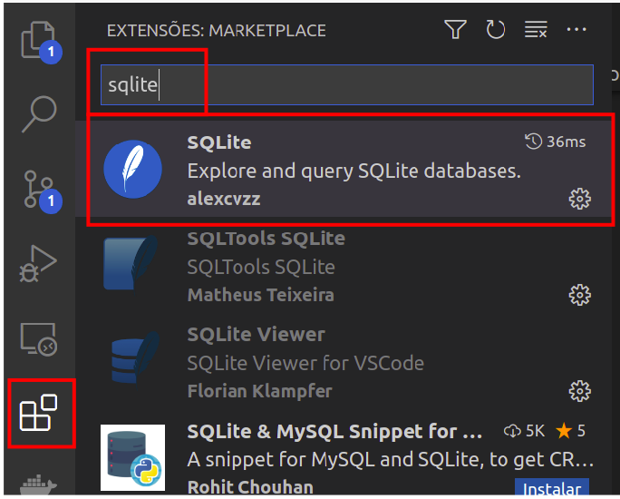

## 3.3. Criação do Banco de Dados
Uma vez que o sqlite esteja instalado, é possível fazer toda a criação do banco de dados e a manipulação dos dados via terminal.

Vamos fazer a criação pelo próprio VSCode.

Na pasta do seu projeto, crie um novo arquivo chamado `curso.db`.

Com o botão direito do Mouse, clique sobre o arquivo `curso.db`, e em seguida clique no menu **"Open Database"**. 

Perceba que uma nova aba aparecerá para o **"SQLITE EXPLORER"**, e a base `curso.db` estará aparecendo ali.

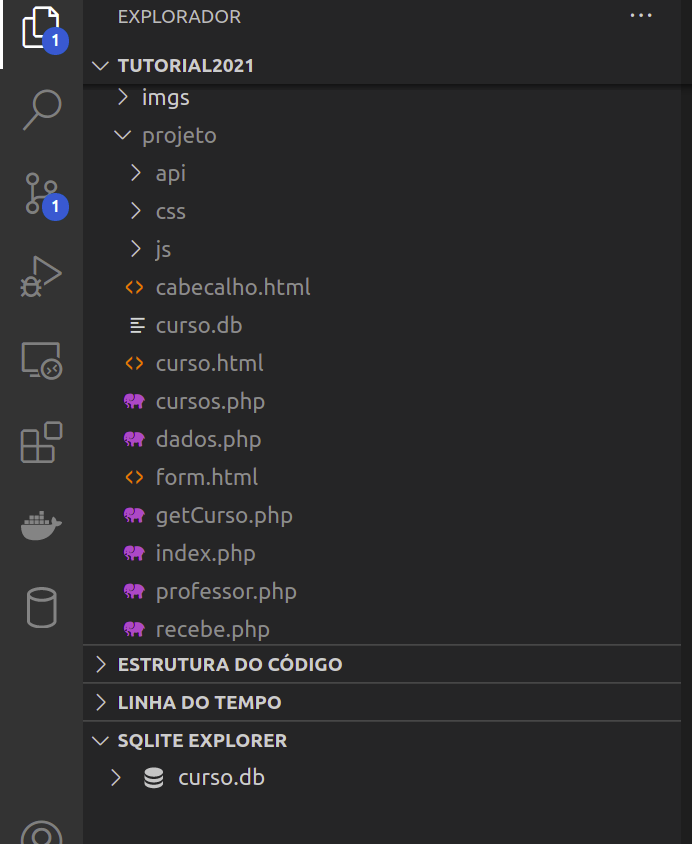

Clicando com o botão direito sobre o database `curso.db`, selecione **"New query"**.

Uma nova janela aparecerá, onde escreveremos as instruções SQL para a criação das tabelas:
- professor;
- curso;
- disciplina;

E, posteriormente, os SQLs para a inclusão dos dados nestas tabelas.

### 3.3.1. Criação da tabela professor

Conforme a estrutura dos dados que vinhamos utilizando, nossa tabela `professor` terá:
- id inteiro, chave primária, autoincremento;
- nome texto 
- email texto 

#### SQL para criação da tabela professor
Execute a query com o seguinte conteúdo:
```sql
CREATE TABLE `professor` (
	`id`	INTEGER PRIMARY KEY AUTOINCREMENT,
	`nome`	TEXT(255),
    `email` TEXT(255)
);
```

#### Inserindo dados na tabela professor
Corrija os emails, e execute a query com o seguinte conteúdo
```sql
INSERT INTO professor VALUES(1,'André Moraes', 'a****s@ifc.edu.br');
INSERT INTO professor VALUES(2,'Ângelo Frozza', 'a****a@ifc.edu.br');
INSERT INTO professor VALUES(3,'Daniel Anderle', 'd****e@ifc.edu.br');
INSERT INTO professor VALUES(4,'Daniel Varela', 'd****a@ifc.edu.br');
INSERT INTO professor VALUES(5,'Rafael Speroni', 'r****i@ifc.edu.br');
INSERT INTO professor VALUES(6,'Lidiane Visintin', 'l****n@ifc.edu.br');
```

Tratam-se de instruções de INSERT na tabela professor, com os mesmos dados que tinhamos nos Arrays até a parte 2 do roteiro.

### 3.3.2. Criação da tabela curso

Em seguida, criaremos a tabela curso. Observe que a ordem de criação é importante, uma vez que estamos indicando a existência de uma chave estrangeira (fk_coordenador), que aponta para a tabela professor.

#### SQL para a criação da tabela curso

Execute a query com o seguinte conteúdo.
```sql
CREATE TABLE `curso` (
	`id`	INTEGER PRIMARY KEY AUTOINCREMENT,
	`nome`	TEXT(255),
	`semestres`	INTEGER,
	`id_coordenador`	INTEGER,
	constraint fk_coordenador
	  foreign key(id_coordenador)
	  references professor(id)
);
```

#### Inserindo dados na tabela professor

Execute o seguinte conteúdo:
```sql
INSERT INTO curso VALUES(1,'Tecnologia em Sistemas para Internet - TSI',6,5);
INSERT INTO curso VALUES(2,'Bacharelado em Sistemas de Informação',8,3);
INSERT INTO curso VALUES(3,'Técnico em Informática Integrado',6,2);
INSERT INTO curso VALUES(4,'Bacharelado em Agronomia',8,6);
INSERT INTO curso VALUES(5,'PROEJA',6,5);
```

### 3.3.3. Criação da tabela disciplina

Agora, criaremos a tabela disciplina. Da mesma forma, há uma chave estrangeira (fk_disc_curso).

#### SQL para a criação da tabela disciplina

Execute o seguinte conteúdo:
```sql
CREATE TABLE `disciplina` (
	`id`	INTEGER PRIMARY KEY AUTOINCREMENT,
	`codigo` TEXT(15),
	`nome`	TEXT(255),
	`carga`	INTEGER,
	`ementa`	TEXT(512),
	`semestre`	INTEGER,
	`id_curso`	INTEGER,
	constraint fk_disc_curso
	  foreign key(id_curso)
	  references curso(id)
);
```

#### Inserindo os dados na tabela disciplina

Execute o segundo conteúdo:
```sql
INSERT INTO disciplina VALUES(1,'STB0301','Matemática Elementar',60,'Conjuntos Numéricos: Conjunto dos números Naturais; Conjunto dos números Inteiros; Conjunto dos números Racionais: Frações e operações com frações.',1,1);
INSERT INTO disciplina VALUES(2,'STB0302','Inglês Instrumental',60,'Conscientização do processo de leitura. Estratégias de leitura. Gramática aplicada da língua inglesa. Reconhecimento de gêneros textuais e aquisição de vocabulário. Análise textual de um gênero. Leitura intensiva de diversos gêneros textuais da área de Informática. Redação acadêmica.',1,1);
INSERT INTO disciplina VALUES(3,'STB0303','Introdução à Computação',30,'Evolução da computação (tecnologias e usos). Modelos funcionais dos computadores. Sistemas de códigos e codecs. Sistemas operacionais. Linguagens de programação. Sistemas de rede e Internet. Open Source/Free Software. O estado da arte. TI x Sustentabilidade.',1,1);
INSERT INTO disciplina VALUES(4,'STB0304','Introdução à Programação Web',60,'Infraestrutura do Ambiente Web; Páginas Estáticas e Páginas Dinâmicas; Introdução a Linguagem de Marcação HTML e suas evoluções; Folhas de Estilos (CSS); Introdução a Programação Client-Side (JavaScript); Princípios para Web Design Responsivo.',1,1);
INSERT INTO disciplina VALUES(5,'STB0305','Algoritmos e Técnicas de Programação',90,'Introdução à lógica de programação. Conceitos básicos sobre algoritmos. Algoritmos Estruturados: conceitos, estruturas de controle (seqüência, seleção e repetição)entrada e saída, atribuição; Operadores Básicos (Aritméticos, Relacionais e Lógicos); Resolução de problemas usando algoritmos; Verificação e correção de algoritmos através de testes de mesa; Implementações de algoritmos em uma linguagem de programação.Procedimentos e Funções.',1,1);
INSERT INTO disciplina VALUES(6,'STB0306','Estrutura de Dados',60,'Conjuntos Numéricos: Conjunto dos números Naturais; Conjunto dos números Inteiros; Conjunto dos números Racionais: Frações e operações com frações.',2,1);
INSERT INTO disciplina VALUES(7,'STB0307','Banco de Dados I',60,'Conscientização do processo de leitura. Estratégias de leitura. Gramática aplicada da língua inglesa. Reconhecimento de gêneros textuais e aquisição de vocabulário. Análise textual de um gênero. Leitura intensiva de diversos gêneros textuais da área de Informática. Redação acadêmica.',2,1);
INSERT INTO disciplina VALUES(8,'STB0308','Sistemas Operacionais',60,'Evolução da computação (tecnologias e usos). Modelos funcionais dos computadores. Sistemas de códigos e codecs. Sistemas operacionais. Linguagens de programação. Sistemas de rede e Internet. Open Source/Free Software. O estado da arte. TI x Sustentabilidade.',2,1);
INSERT INTO disciplina VALUES(9,'STB0309','Engenharia de Software I',60,'Infraestrutura do Ambiente Web; Páginas Estáticas e Páginas Dinâmicas; Introdução a Linguagem de Marcação HTML e suas evoluções; Folhas de Estilos (CSS); Introdução a Programação Client-Side (JavaScript); Princípios para Web Design Responsivo.',2,1);
INSERT INTO disciplina VALUES(10,'STB0305','Programação Web',60,'Introdução à lógica de programação. Conceitos básicos sobre algoritmos. Algoritmos Estruturados: conceitos, estruturas de controle (seqüência, seleção e repetição)entrada e saída, atribuição; Operadores Básicos (Aritméticos, Relacionais e Lógicos); Resolução de problemas usando algoritmos; Verificação e correção de algoritmos através de testes de mesa; Implementações de algoritmos em uma linguagem de programação.Procedimentos e Funções.',2,1);
INSERT INTO disciplina VALUES(11,'SIB0312','Desenvolvimento Web I',60,'Introdução à lógica de programação. Conceitos básicos sobre algoritmos. Algoritmos Estruturados: conceitos, estruturas de controle (seqüência, seleção e repetição)entrada e saída, atribuição; Operadores Básicos (Aritméticos, Relacionais e Lógicos); Resolução de problemas usando algoritmos; Verificação e correção de algoritmos através de testes de mesa; Implementações de algoritmos em uma linguagem de programação.Procedimentos e Funções.',5,2);
INSERT INTO disciplina VALUES(12,'SIB0313','Desenvolvimento Web II',60,'Introdução à lógica de programação. Conceitos básicos sobre algoritmos. Algoritmos Estruturados: conceitos, estruturas de controle (seqüência, seleção e repetição)entrada e saída, atribuição; Operadores Básicos (Aritméticos, Relacionais e Lógicos); Resolução de problemas usando algoritmos; Verificação e correção de algoritmos através de testes de mesa; Implementações de algoritmos em uma linguagem de programação.Procedimentos e Funções.',6,2);
```

### 3.4. Testando consultas SQL

Na janela de consulta (Query), teste a execução das seguintes consultas:

```sql
select * from professor;
```

E deverá ver como resultado o conjunto de linhas e colunas retornadas pela operação.

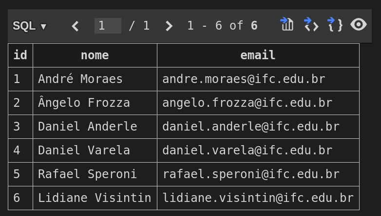

```sql
select * from curso;
```

E deverá ver como resultado o conjunto de linhas e colunas retornadas pela operação.

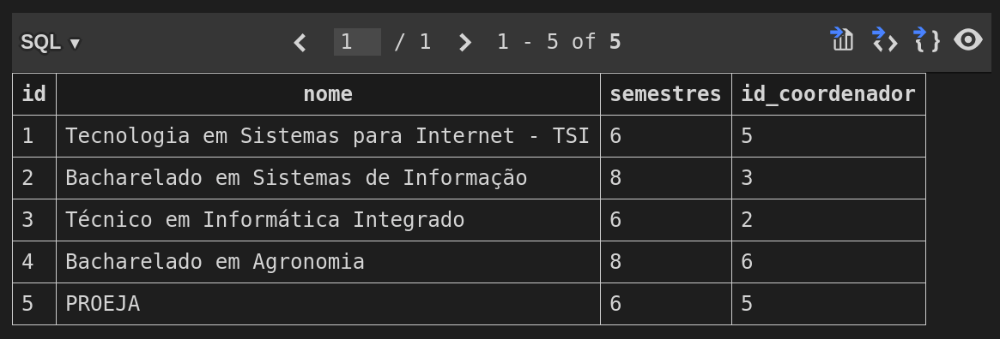

```sql
select * from disciplina;
```

E deverá ver como resultado o conjunto de linhas e colunas retornadas pela operação.

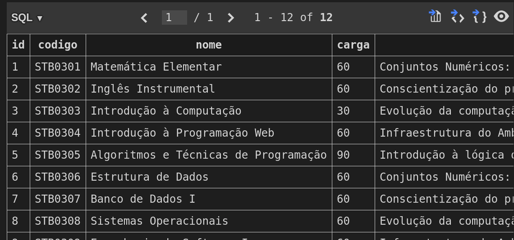


## 3.5. Trazendo dados de um Banco de Dados para a página

Até o momento, nossas páginas eram construídas da seguinte forma:
* Digitando ou clicando no navegador, uma requisição HTTP é feita ao servidor, solicitando uma página;
* Servidor entrega a página "pronta" (sem dados);
* Após a página ser carregada, uma função Javascript faz uma requisição assíncrona (AJAX) a um "endpoint" (ex. api/dadoscursos.php);
* O endpoint recebe a requisição, e invoca uma função responsável por buscar os dados (neste momento, no array);
* Com o resultado da execução da função, um JSON é montado e entregue a quem solicitou (via requisição AJAX);
* Ao receber os dados em JSON, a função Javascript manipula os dados e os inclui na página, pela modificação de seu conteúdo.

De maneira geral, o mecanismo continua todo o mesmo. A principal diferença é que os dados não virão mais de Arrays, e sim de um Banco de Dados (que acabamos de criar).

Portanto, o que precisamos fazer, de imediato, é **alterar as funções que buscam os dados**. Em vez de buscar de Arrays, deverão buscar do Banco de Dados.

### 3.5.1. Estabelecendo uma conexão ao Banco de Dados

Para que possamos utilizar um Banco de Dados, há um "motor" por trás, ou o nosso servidor de Banco de Dados. Neste caso, estamos utiilzando o SQLite como servidor. E nossa aplicação estará fazendo o papelo de "cliente" ou "consumidor" deste serviço.

Por isso, para que possamos utilizar os dados armazenados em um Banco de Dados, será necessário **estabelecer uma conexão**.

Dependendo do SGBD utilizado, os critérios para esta conexão mudam.

**IMPORTANTE**
Em nossas páginas, essa "conversa" com o Banco de Dados ficará a cargo da parte que estamos chamando de back-end. Ou seja, o front-end continuará apenas enviando e recebendo dados do back-end. E o bach-end é que será responsável por obter os dados.

Como nossa parte de back-end está codificada em PHP, utilizaremos uma extensão chamada PDO (PHP Data Objects). Trata-se de uma interface para acesso a bancos de dados em PHP. O PDO conta com drivers específicos para diferentes SGBDs.

Um ponto importante é que o PDO provê uma camada de abstração, ou seja, independente de qual SGBD se deseja utilizar, utiliza-se as mesmas funções para efetuar consultas e retornar dados.

#### 3.5.1.1. Exemplo de conexão ao SQLite com PDO

No exemplo a seguir, temos um exemplo de conexão, utilizando PDO, ao SQLite. 

```php
$conexao = new PDO('sqlite:curso.db');
```
Esta instrução utiliza a notação de Orientação a Objetos, onde se está criando uma instância da classe PDO, e associando este objeto ao identificador `$conexão`. Observe, ainda, que estamos indicando que é um banco do tipo `sqlite:` e que o nome do arquivo do BD é `curso.db`, que está na mesma pasta.

De forma bastante simplificada, isso equivale a dizer que a variável `$conexao` está associada a um objeto do tipo PDO, e que traz consigo todas as características e comportamentos estabelecidos nesta classe (para saber mais, leia sobre classes e objetos - Programação Orientada a Objetos). Para o momento, basta sabermos que `$conexão` poderá utilizar alguns métodos específicos da PDO.

A partir de agora, poderemos fazer uso da `$conexao`, para manipulações e consultas ao Banco de Dados.

Por exemplo, podemos acrescentar algumas informações a esta conexão, como a definição de parâmetros para o tratamento dos erros nesta conexão.

```php
$conexao = new PDO('sqlite:curso.db');
$conexao->setAttribute(PDO::ATTR_ERRMODE, PDO::ERRMODE_EXCEPTION);
```
Aqui estamos indicando que, quando houver um erro, uma exceção (PDOException) será lançada (ver controle de exceções).

### 3.5.2. Criando uma função para buscar dados dos cursos

Na versão anterior, tinhamos uma função chamada `getCursos()`, responsável por retornar os dados dos cursos.

Agora, vamos deixar de utilizar o `dados.php`, e passaremos a utilizar um arquivo chamado `api/conexao.php` (observe que estamos criando na pasta `api`), onde criaremos as funções com os mesmos nomes das anteriores, mas que buscarão os dados do BD.

Portanto, na pasta `api` do seu projeto vamos criar um arquivo `conexao.php`:

```php
$conexao = new PDO('sqlite:../curso.db'); //arquivo .db está na pasta um nível acima, por isso o ../
$conexao->setAttribute(PDO::ATTR_ERRMODE, PDO::ERRMODE_EXCEPTION);

function getCursos(){
        global $conexao; //é uma variavel de fora da função
        
        //usando a conexao, fazer uma consulta SQL
        $resultado = $conexao->query('select id, nome, semestres, id_coordenador as coordenador from curso order by nome');

        //transformar o resultado da consulta em um array associativo
        $cursos = $resultado->fetchAll(PDO::FETCH_ASSOC);
        //retorna o array contendo todos os cursos
        return $cursos;    
}
```

#### 3.5.2.1. Testando o endpoint dadoscursos.php

Conforme informado, estamos querendo substituir a fonte de dados. Deixaremos de utilizar os Arrays que continham os dados (em `dados.php`), e passaremos a utilizar os dados trazidos do Banco de Dados (usando o `api/conexao.php`);

Vamos, então, alterar o arquivo `api/dadoscursos.php`.

```php
<?php
  header('Content-Type: application/json');
  //include_once('../dados.php'); //removemos a inclusão do arquivo que continha os arrays e as funções de acesso aos dados
  include_once('conexao.php'); //incluímos o arquivo com a conexão e a função de busca do BD

  if(isset($_GET['id'])){
    echo json_encode(getCursoPorId($_GET['id']));
  }else{
    echo json_encode(getCursos());
  }
```

Até o momento, temos a função `getCursos()` implementada (ainda precisa de alguns ajustes posteriores). Vamos testar se o endpoint está retornando os dados.

Acessando diretamente o endpoint `http://localhost/......./api/dadoscursos.php`, estaremos invocando a função `getCursos()`, e apresentando o seu JSON resultante:

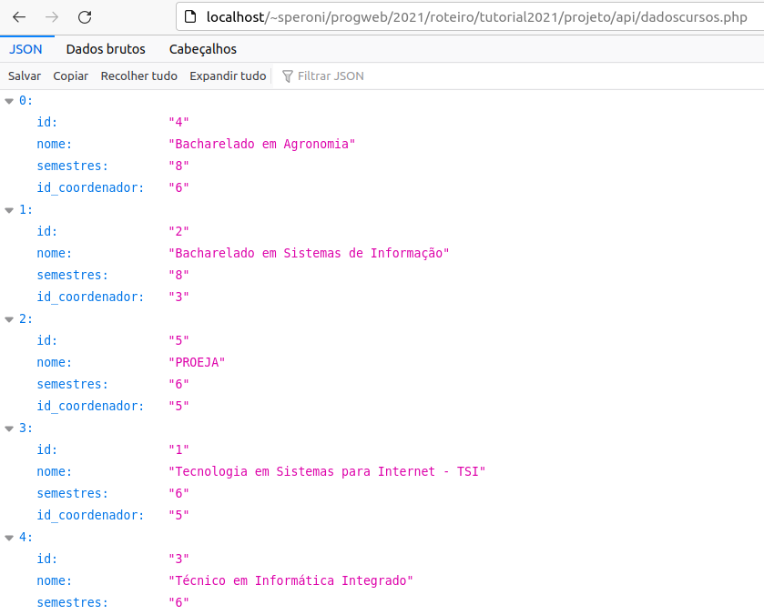

Agora, que o endpoint já está trazendo dados do BD, vamos ver como ficou a nossa página que lista os cursos.

Acessando `http://localhost/..../cursos.php`, teremos algo como:
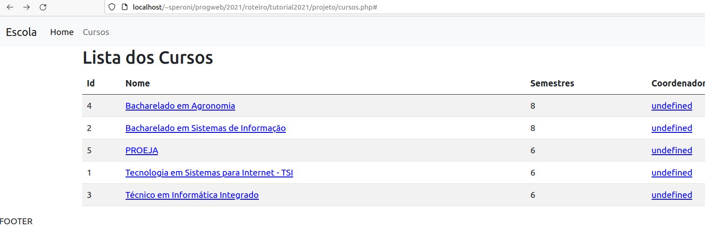

**ATENÇÃO!!**
Observe que temos um problema com o nome dos coordenadores dos cursos.
Faz sentido, se você lembrar que fizemos uma alteração na forma de retorno do Array de cursos, incluindo todos os dados de professor (**ver Parte 2, seção 2.4**). Resolveremos isso logo.

### 3.5.3. Criando uma função para buscar dados do professor

Assim como fizemos com cursos, precisamos implementar a função `getProfessor()`.
Até a parte 2, esta função recebia um id, e retornava o array com os dados do professor correspondente.

Agora, a nova `getProfessor()` receberá um id, e buscará no BD os dados do professor correspondente, retornando-os em um array.

No arquivo `api/conexao.php`, acrescente a função:
```php
function getProfessor($id_professor){
    global $conexao; 
        
    //prepara a consulta com parametro :id
    $resultado = $conexao->prepare("select * from professor where id=:id"); 
    //vinculo valor ao id - o valor q chega de entrada na fcao
    $resultado->bindParam(':id', $id_professor);
    //executar uma consulta
    $resultado->execute();

    //transformar o resultado em array
    $professor = $resultado->fetch(PDO::FETCH_ASSOC);
    //retorna o Array
    return $professor;
}
```

#### 3.5.3.1. Alterando o endpoint dadosprofessores

Assim como fizemos com o `api/dadoscursos.php`, vamos apenas remover a inclusão do arquivo `dados.php`, e incluir o arquivo `conexao.php`.

Em `api/dadosprofessores.php`:
```php
<?php
header('Content-Type: application/json');
//include('../dados.php');// remover
include('conexao.php');//incluir

if(isset($_GET['id'])){
    echo json_encode(getProfessor($_GET['id']));
}else{
    echo "id não definido";
}
```

Veja que o nome da função é o mesmo da que tinhamos ontem.

Vamos testar o acesso direto a este endpoint `http://localhost/....../api/dadosprofessores.php?id=1`.

Teremos: 
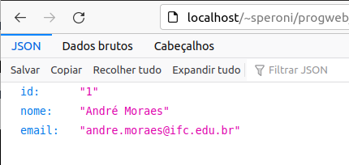

Desta forma, podemos ver que, mesmo com a substituição da função, o nosso endpoint continua funcionando, retornando dados no mesmo formato que retornava antes.

### 3.5.4. Modificando a função getCursos

De forma semelhante ao que fizemos na seção 2.4, queremos, agora, melhorar os dados de cursos, acrescentando todos os dados do professor coordenador.

Vamos fazer uma chamada a função `getProfessor()` para cada um dos cursos.

Em `api/conexao.php`, modifique a função getCursos():
```php
function getCursos(){
        global $conexao; //é uma variavel de fora da função
        
        //usando a conexao, fazer uma consulta SQL
        $resultado = $conexao->query('select id, nome, semestres, id_coordenador as coordenador from curso order by nome');

        //transformar o resultado da consulta em um array associativo
        $cursos = $resultado->fetchAll(PDO::FETCH_ASSOC);
            
        //percorre cada posição do array
        for($i=0; $i<sizeof($cursos); $i++){
            //busca o professor correspondente, recebe o Array
            $coordenador = getProfessor($cursos[$i]['coordenador']);
            //substitui o valor da posição coordenador pelo Array
            $cursos[$i]['coordenador'] = $coordenador;
        }    
        
        //retorna o array contendo todos os cursos
        return $cursos;    
}
```
Agora, podemos verificar, acessando diretamente o endpoint `api/dadoscursos.php`, que os dados do coordenador vieram completos, tal como havíamos feito na seção 2.4.
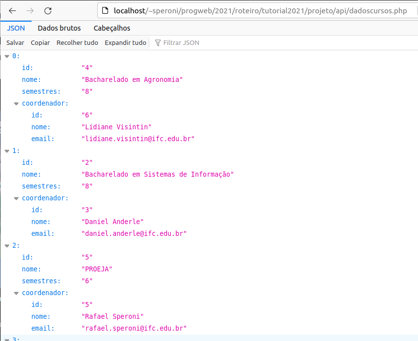

Por consequência dessa modificação dos dados, nossa página `cursos.php`, agora, traz os nomes dos coordenadores, e os links funcionam:
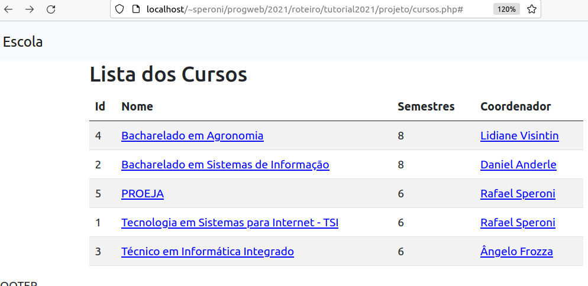

### 3.5.4 - Página de detalhes de professor

Observe que a página de detalhamento dos dados de um professor já está funcionando.
É o que se esperava, uma vez que os dados são trazidos pelo mesmo endpoint `api/dadosprofessores.php`, que já está recuperando os dados do BD.

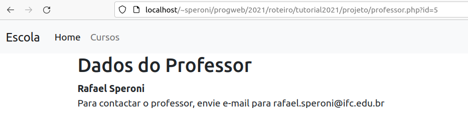

### 3.5.5 - Página de detalhes do curso

Agora, precisamos modificar o endpoint `api/dadoscurso.php`, para apresentar os dados de um curso. Para isto, precisaremos criar uma nova função `getCursoPorId()`, que retorne os dados do BD.

No arquivo `api/conexao.php`, acrescente a função `getCursoPorId()`:

```php
function getCursoPorId($id_curso){
    global $conexao; 
    
    //prepara a consulta com parametro :id
    $resultado = $conexao->prepare("select id, nome, semestres, id_coordenador as coordenador from curso where id=:id"); 
    //vinculo valor ao id - o valor q chega de entrada na fcao
    $resultado->bindParam(':id', $id_curso);
    //executar uma consulta
    $resultado->execute();

    //transformar o resultado em array
    $curso = $resultado->fetch(PDO::FETCH_ASSOC);
    //recupera os dados do coordenador e guarda no array
    $curso['coordenador'] = getProfessor($curso['coordenador']);
    //retorna o array com os dados do curso
    return $curso;
}
```

Observe que já fizemos com que o array retornado pela função já contenha todos os dados do professor

Verifique o acesso direto ao endpoint de cursos `http://localhost/...../api/dadoscursos.php?id=1`, que irá invocar a função `getCursoPorId(1)`: 

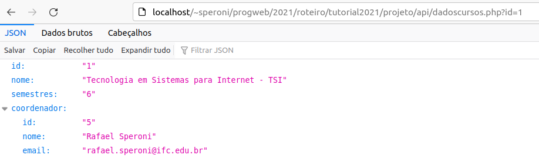


#### 3.5.5.1 - Lista de Disciplinas (ATUALIZAÇÃO JAN/2022)

Por fim, para a finalização da Parte 3 deste roteiro, precisamos fazer as alterações para que as disciplinas sejam trazidas do Banco de Dados, em vez do Array.

Assim, faremos:
1. Alteração do api/dadosdisciplinas.php:
  - Substituição da origem dos dados e das funções (sai o "dados.php" e entra o "conexao.php");
2. Criação de função de recuperação dos dados de disciplina, com a mesma assinatura (nome de função e parâmetros) daquela que eram utilizada para retornar dados do Array.

##### 3.5.5.1.1 - Alteração da Fonte dos dados em api/dadosdisciplinas.php

Da mesma forma como fizemos com os demais endpoints, vamos alterar o `api/dadosdisciplinas.php`, para que os dados sejam recuperados do Banco de Dados, e não mais do Array. Para isto, removeremos a chamada ao arquivo `../dados.php`, e incluiremos a chamada ao arquivo `conexao.php`.

Em `api/dadosdisciplinas.php`:

```php
<?php
require_once('conexao.php');
```

Com essa alteração, observe que a página `curso.html` não apresenta mais as disciplinas daquele curso. O que faz sentido, uma vez que a função responsável por buscar disciplinas no Banco de Dados ainda não foi criada.

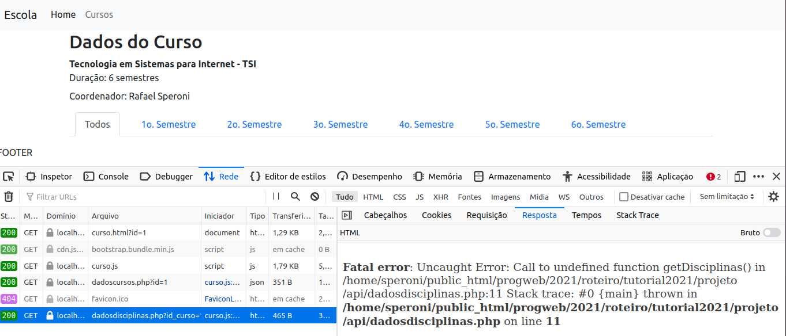

Na imagem, podemos observar que a requisição para `api/dadosdisciplinas.php` é feita, mas a mesma retorna um erro, indicando que a função `getDisciplinas()` não foi encontrada. Portanto, não é possível obter os dados das disciplinas.

##### 3.5.5.1.2 - Criação da função getDisciplinas()

Esta função recebe o id do curso e o semestre.
Faz uma consulta ao Banco de Dados, na tabela **disciplina**.
Retorna um array com as disciplinas correspondentes.

Um detalhe importante: Na função anterior, havíamos considerado que, quando passado o semestre 0 para o parâmetro, queremos TODAS as disciplinas do curso. Dessa forma, a função deverá considerar isso, também, para realizar a consulta.

No arquivo `conexao.php`, crie a função:
```php
function getDisciplinas($id_curso, $semestre){
    global $conexao; 
    if ($semestre == 0){ //não filtrar por semestre
        //prepara a consulta com parametro :id_curso e :semestre
        $resultado = $conexao->prepare("select * from disciplina where id_curso=:id_curso"); 
    }else{ //filtrar tambem por semestre
        //prepara a consulta com parametro :id_curso e :semestre
        $resultado = $conexao->prepare("select * from disciplina where id_curso=:id_curso and semestre=:semestre"); 

        //vinculo valor ao semestre - o valor q chega de entrada na fcao
        $resultado->bindParam(':semestre', $semestre);
    }    
    //vinculo valor ao id - o valor q chega de entrada na fcao
    $resultado->bindParam(':id_curso', $id_curso);
    //executar uma consulta
    $resultado->execute();

    //transformar o resultado em array
    $disciplinas = $resultado->fetchAll(PDO::FETCH_ASSOC);
    //recupera os dados do coordenador e guarda no array
    return $disciplinas;
}
```

Acessando a página, agora, podemos ver as disciplinas listadas, bem como a requisição ao `api/dadosdisciplinas.php`, com o JSON de resposta, no inspector.

.

## 3.6 - FIM DA PARTE 3

Chegamos ao fim da parte 3 do Roteiro.

Estou trabalhando em uma parte 4, na qual pretendo deixar, como referência, um CRUD (CREATE, READ, UPDATE, DELETE) em funcionamento, ou seja, as funcionalidades de um Cadastro de Curso.

Este CRUD NÃO SERÁ COBRADO PARA ENTREGA.